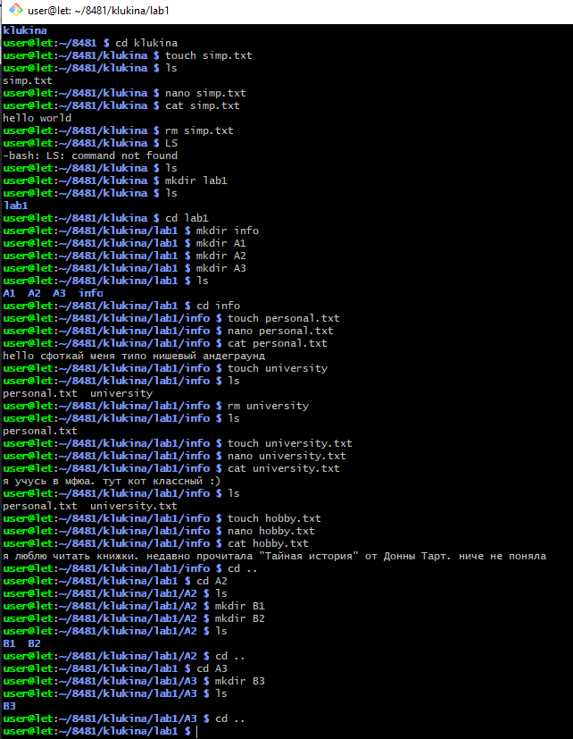
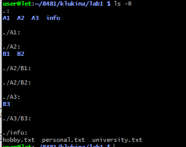

# Лабораторная работа № 1
## Командная строка Windows

**Цель работы:** Развитие профессиональных навыков работы в командной строке Windows.

**Задачи работы:**
- Создание структуры каталогов;
- Создание, просмотр, редактирование, удаление файлов;
- Удаление структуры каталогов;
- Манипулирование операционной системой Windows с помощью командной строки.

## Задание на лабораторную работу

Загрузить командную строку (Пуск – Программы – Стандартные – Командная строка).

1. В каталоге `Temp` создать дерево каталогов по вариантам как показано в вариантах заданий с использованием команд табл. 1.
2. В каталоге `А2` создать подкаталоги `В4` и `В5` и удалить каталог `В2`.
3. В каталоге `Personal` создать файл `Name.txt`, содержащий информацию о фамилии, имени и отчестве студента. Здесь же создать файл `Date.txt`, содержащий информацию о дате рождения студента. В этом же каталоге создать файл `School.txt`, содержащий информацию о школе, которую закончил студент.
4. В каталоге `University` создать файл `Name.txt`, содержащий информацию о названии вуза и специальность, на которой студент обучается. Здесь же создать файл `Mark.txt` с оценками на вступительных экзаменах и общей суммой баллов.
5. В каталоге `Hobby` создать файл `hobby.txt` с информацией об увлечениях студента.
6. Скопировать файл `hobby.txt` в каталог `А2` и переименовать его в файл `Lab_№варианта.txt`.
7. Сделать копию файла `Lab_№варианта.txt` (например, `copy_Lab_№варианта.txt`) в этом же каталоге и удалить его.
8. Очистить экран от служебных записей.
9. Вывести на экран поочередно информацию, хранящуюся во всех файлах каталога `Personal`.
10. Отсортировать все файлы, хранящиеся в каталоге `Personal`, по имени.
11. Объединить все файлы, хранящиеся в каталоге `Personal`, в файл `all.txt` и вывести его содержимое на экран.
12. Отредактировать файл `all.txt`, добавив в него год вашего рождения, и вывести его содержимое на экран.
13. Скопировать файл `all.txt` в директорию `A1`.
14. Удалить все директории, в названии которых есть буква `А` или цифра `2`.
15. Изменить строку приглашения в соответствии с номером варианта.

## Необходимые команды

| Название команды | Синтаксис команды |
|----------------|-------------------|
| Создание файла с консоли | `copy con <имя файла>` |
| Удаление файла | `del <имя файла>` |
| Переименование файла | `ren <имя файла 1> <имя файла 2>` |
| Редактирование файла | `edit <имя файла>` |
| Переход на диск | `<имя диска>` |
| Переход в каталог | `cd <путь>` |
| Сортировка по имени файлов каталога | `Dir /ON` |
| Сортировка по расширению файлов каталога | `Dir /OE` |
| Создание каталога | `md <имя каталога>` |
| Удаление каталога | `rd <имя каталога>` |
| Очистка окна | `cls` |
| Вывод содержимого файла на экран | `type <имя файла>` |
| Копирование файла | `copy <путь 1 (что копируется)> <путь 2 (куда копируется)>` |
| Поиск файла | `filefind <имя файла>` |
| Работа с командной строкой | `prompt` |
| Информация о команде | `<команда> /?` |

## Варианты заданий

**Вариант № 1:** В строке приглашения вывести системную дату.

## Контрольные вопросы

**1. Что такое командная строка?**  
Командная строка — это текстовый интерфейс взаимодействия пользователя с операционной системой, в котором команды вводятся в виде текстовых строк и выполняются интерпретатором команд (например, `cmd.exe` в Windows).

**2. Перечислите основные команды управления файлами в командной строке.**  
- `dir` — просмотр содержимого каталога  
- `cd` — смена текущего каталога  
- `copy` — копирование файлов  
- `move` — перемещение файлов  
- `del` — удаление файлов  
- `ren` — переименование файлов  
- `md` / `mkdir` — создание каталога  
- `rd` / `rmdir` — удаление каталога  

**3. Перечислите команды вывода основной информации системы.**  
- `ver` — версия операционной системы  
- `date` — вывод и изменение системной даты  
- `time` — вывод и изменение системного времени  
- `systeminfo` — подробная информация о системе  
- `whoami` — имя текущего пользователя  
- `prompt` — настройка вида приглашения командной строки  

**4. Перечислите команды ввода/вывода файлов.**  
- `type` — вывод содержимого текстового файла на экран  
- `copy con` — создание файла с вводом с клавиатуры  
- `echo` — вывод текста или запись в файл (`echo текст > файл.txt`)  
- `more` — постраничный вывод содержимого файла  
- `find` — поиск строк в файлах  

**5. Возможно ли полноценное управление системой, пользуясь только командной строкой? Ответ обоснуйте.**  
Да, возможно. Командная строка позволяет выполнять все основные задачи: управление файлами и каталогами, запуск программ, настройку сети, управление процессами, работу с реестром, учетными записями и дисками. Однако для некоторых задач (например, настройка графических параметров или работа с мультимедиа) графический интерфейс может быть удобнее.

**6. Подумайте, чем отличается командная строка Windows от командной строки MS-DOS, несмотря на их схожесть в командах.**  
- MS-DOS была полноценной операционной системой, а командная строка Windows — это эмулятор, работающий поверх Windows.  
- В командной строке Windows доступны дополнительные команды (например, `ping`, `ipconfig`).  
- Поддерживаются длинные имена файлов и пробелы в именах (с использованием кавычек).  
- Есть возможность вызова команд WMI и PowerShell.  
- Отсутствуют некоторые старые команды MS-DOS (например, `memmaker`).

**7. Приведите примеры интерпретаторов команд в других операционных системах.**  
- **Linux / Unix:** `bash`, `sh`, `zsh`, `fish`, `ksh`  
- **macOS:** `zsh` (по умолчанию), `bash`  
- **Windows (альтернативные):** PowerShell, `WinRE` командная строка  
- **Android:** `adb shell` (командная оболочка Unix-подобная)  
