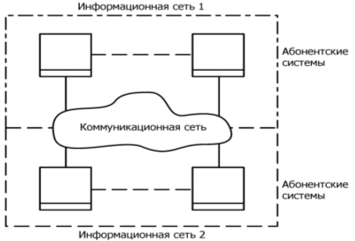
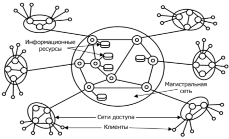
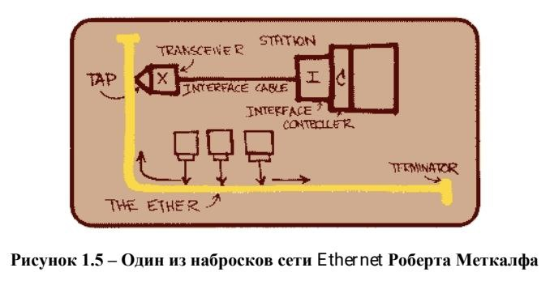

# Лекция № 1. Введение
## Основные понятия дисциплины
### Сеть (Network) – взаимодействующая совокупность объектов (узлов, nodes).
Компьютерная сеть или сеть передачи данных (Computer Network) – это совокупность связанных между собой компьютеров, телекоммуникационного оборудования и программного обеспечения, обеспечивающая информационный обмен между компьютерами в сети.
### Узел компьютерной сети – хост или конечная система.
Конечные системы соединяются между собой при помощи линий связи и коммутаторов пакетов.

Пакеты – отдельные порции информации, передаваемые по сети.
## Состав компьютерной сети.
− Компьютеры, соответствующие назначению компьютерной сети;

− Коммуникационное оборудование;

− Сетевые операционные системы (NOS – Network Operation System);

− Сетевые приложения.
### Телекоммуникации – (греч. tele – вдаль, далеко и лат. communicatio – общение) – это передача и прием любой информации (звука, изображения, данных, текста) на расстояние по различным электромагнитным системам.
### Телекоммуникационная сеть – это система технических средств, посредством которой осуществляются телекоммуникации.
Телекоммуникационную сеть условно принято разделять на коммуникационную сеть и информационную сеть (см. рис. 1.1).

Коммуникационная сеть – предназначена для передачи данных.
### Информационная сеть – предназначена для обработки, хранения и
передачи данных и создается подключением к коммуникационной сети абонентских систем.

### Рисунок 1.1 – Структура телекоммуникационной сети
К телекоммуникационным сетям относятся:

− Компьютерные сети (передача данных);

− Телефонные сети (передача голосовой информации);
−Радиосети (передача голосовой информации – широковещательные услуги);

− Телеграфные сети (передача текстовых сообщений);

− Телевизионные сети и т.д.
# Телекоммуникационные сети

### Рисунок 1.2 – Состав телекоммуникационной сети
сети доступа (access network);

− магистральная сеть или магистраль (core network или backbone);

− информационные центры или центры управления сервисами (data centers или service control point).

Сеть доступа – нижний уровень ТС, к которому подключаются «конечные узлы» – оборудование пользователей.

Магистральная сеть – объединяет СД и выполняет транзит трафика по высокоскоростным каналам.

Информационные центры – собственные информационные ресурсы сети на основе которых выполняется обслуживание пользователей.
### Классификации сетей

− По территориальному признаку

− По масштабу производственного объединения

− По технологии передачи

− По принципу организации обмена данными между абонентами

− По типу среды передачи данных

− По принципу организации иерархии компьютеров и т.д.
### Классификация сетей по территориальному признаку:

− Локальные сети (ЛС, LAN – Local Area Network);

− Глобальные сети (ГС, WAN – Wide Area Network);

− Региональные (городские) сети (MAN, Metropolitan Area Network).

### Локальная сеть – сеть ЭВМ, включающая в себя узлы, расположенные в пределах одного помещения, здания или небольшой территории, позволяющая обмениваться данными и совместно использовать различные устройства.
Примеры: компьютерная сеть в отдельной лаборатории университета, локальная сеть главного корпуса университета, а также сеть, расположенная в главном корпусе университета и корпусе худграфа.

Глобальные сети – сети, объединяющие территориально рассредоточенные компьютеры, возможно находящиеся в различных городах и странах.
Примеры: глобальная сеть Интернет, сеть Fido и др.

Региональные (городские) сети – сети, предназначенные для обслуживания территории района, крупного города или региона.
Пример: городские сети определенного провайдера интернет-услуг, например, МТС.
### Классификация по масштабу производственного подразделения:

− Сети отделов (рабочих групп);

− Сети кампусов (от англ campus – университет, территория университета) а также домовые сети, объединяющие несколько домов;

− Корпоративные сети (сети масштаба предприятия – enterprise wide networks).
### Классификация по технологии передачи данных:

Вещание (или один – ко многим) использует broadcast или, по-другому, основана на разделяемых каналах передачи данных (shared channel);

Соединение точка – точка (point-to-point) – передача данных ведется между двумя абонентами.
### Классификация по принципу организации обмена данными между абонентами:
Сети на основе коммутации:

− Каналов;

− Пакетов;

− Сообщений (промежуточный вариант).

Коммутация – технология выбора направления и организации передачи данных в сетях, имеющих несколько альтернативных маршрутов, по которым может производиться обмен информацией между двумя узлами. При этом передаваемые по сети информационные потоки называются сетевым трафиком (от англ. traffic – движение).
### Классификация по типу среды передачи данных:
− Проводные (wired) (коаксиальный кабель, витая пара, оптоволоконные линии);

− Беспроводные (wireless) (радиочастоты, инфракрасный диапазон).
### Классификация по принципу организации иерархии компьютеров:

− Одноранговые (Peer-to-Peer Network);

− Клиент-серверные (с выделенным сервером, Dedicated Server Network).

### Сервер (от англ. server – служащий, служитель) – компьютер или программа, предоставляющая услуги другим компьютерам или программам, обычно называемым клиентами.

### Клиент – это компьютер или программа, запрашивающая некоторые услуги.

### Распределенная программа – это программа, состоящая из нескольких взаимодействующих частей, причем каждая часть может выполняться и, как правило, выполняется на отдельном компьютере.
## Основное назначение компьютерных сетей
− Обеспечение доступа к разделяемым ресурсам;
− Межперсональная коммуникация.
Разделяемый (сетевой) ресурс (network share) – это устройство или информация, к которой возможен удалённый доступ с другого компьютера (обычно в ЛС или интранет), как к локальному ресурсу.
## Услуги доступа к ресурсам:
− Удаленный доступ (Remote Login);
− Передача файлов (File Transfer);
− Удаленный вызов процедур (RPC – Remote procedure call);
− Совместное использование устройств.
## Услуги межперсональной коммуникации:
− Электронная почта (e-mail) 1:1
− Списки рассылки (news group) 1:n
− Телеконференции n:n
− Системы электронных бюллетеней (BBS – Bulletin Board
System)
− Видеоконференции и т.д.
## История сетей
### 60-е 
– DARPA ведет проект по объединению двух удаленных мейнфреймов, первые глобальные связи компьютеров, эксперименты с пакетными сетями, начало передачи голоса по телефонным сетям в цифровой форме.
### 1969 год 
– ARPA (Advanced Research Project Agency) мин.обороны США инициировала работы по объединению в единую сеть суперкомпьютеров оборонных и научно-исследовательских центров – сеть ARPANET (см. рис. 1.3–1.4).

### Начало 70-х – появление первых нестандартных локальных сетей.
1971 г. – инженер BBN Рей Томлинсон написал первую программу для работы с электронной почтой.

1973 г. – Роберт Меткалф (Xerox) предложил идею и название сетевой технологии – Ethernet (см. рис. 1.5).

1974 год – Винтон Серф и Роберт Кан разработали протокол управления передачей TCP.

1978/79 – разработка эталонной модели OSI.

### Начало 1980-х – создание стека протоколов TCP/IP, рассчитанного на
независимость компьютера и сети. Развертывание его на всех узлах ARPANET-сетей и создание сети Интернет в современном виде.

2 ноября 1988 года – червь Морриса (т.н. великий червь) поразил около 6000 узлов ARPANET и практически вывел из строя сеть. Как один из результатов была организована CERT (computer emergency response team).

### Середина 80-х – разработка стандартных технологии локальных сетей
(1980 – Ethernet, 1985 – Token Ring, 1985 – FDDI).

Конец 1980-х – начало 1990-х – замена ARPANET на NSFNet – сеть национального научного фонда NSF (National Science Foundation).

1991–1992 год – изобретение в CERN Тимом Бернерс-Ли с коллегами технологии World Wide Web.

1994 – создание протокола PPP

1995 – замена сети NFSNet более современной коммерческой опорной сетью и появление поставщиков услуг Интернета (ISP, Internet Service Providers). Переход к современному статусу сети Интернет.