# Лабораторная работа № 1
## Подключение персонального компьютера к локальной вычислительной сети

**Цель работы:** приобретение практических знаний и навыков в выборе и установке сетевых адаптеров, монтажу и разделке сетевого кабеля, физическому присоединению ЭВМ к кабельной системе при создании локальной компьютерной сети по технологии Ethernet.

**Материалы, оборудование, программное обеспечение:** IBM PC-совместимый персональный компьютер, сетевая карта (для шины данных PCI) производительностью 10-100 Mbit/сек с разъёмом RJ-45, кабель UTP категории 5, вилки RJ-45, обжимной инструмент.

**Критерии положительной оценки:** выполнение типового задания, оформление отчета по работе, ответы на вопросы для самопроверки.

**Планируемое время выполнения:**
- Аудиторное время выполнения (под руководством преподавателя): 6 часов.
- Время самостоятельной подготовки: 2 часа.

---

## Теоретическое введение

Сетевой стандарт Ethernet был разработан в 1975-х гг. в исследовательском центре корпорации Xerox, после чего доработан совместно DEC, Intel и XEROX (отсюда сокращение DIX) и впервые опубликован как 'Blue Book Standart' для Ethernet I в 1980 г. Этот стандарт получил дальнейшее развитие и в 1985 г. вышел новый — Ethernet II (известный также как DIX).

На основе стандарта Ethernet DIX был разработан стандарт IEEE 802.3, одобренный в 1985 г. для стандартизации комитетом по LAN IEEE (Institute of Electrical and Electronics Engineers). В зависимости от вида физической среды передачи данных стандарт IEEE 802.3 имеет модификации (число 10 в начале каждой обозначает скорость передачи данных 10 Мбит/сек):

| Модификация | Описание |
|-------------|----------|
| 10Base-5 | коаксиальный кабель диаметром 0,5 дюйма («толстый» коаксиал, 50 Ом, макс. длина сегмента 500 м) — бесперспективен |
| 10Base-2 | коаксиальный кабель диаметром 0,25 дюйма («тонкий» коаксиал, 50 Ом, макс. длина сегмента 185 м) — бесперспективен |
| 10Base-T | кабель на основе неэкранированной витой пары (UTP), топология «звезда» с концентратором, макс. расстояние до 100 м |
| 10Base-F | волоконно-оптический кабель: FOIRL (до 1000 м), 10Base-FL и 10Base-FB (до 2000 м) |

В 1995 г. принят стандарт Fast Ethernet (IEEE 802.3u), в 1998 г. — Gigabit Ethernet (IEEE 802.3z), в 2002 г. — 10 Gigabit Ethernet (IEEE 802.3ae). Ethernet и Fast Ethernet применяют один и тот же метод разделения среды передачи данных CSMA/CD (Carrier Sense Multiple Access with Collision Detection — метод коллективного доступа с опознаванием несущей и обнаружением коллизий).

Кабель UTP является наиболее дешевым (при обеспечении достаточной скорости передачи данных и простоте монтажа). UTP-кабели категории 1 применяются в основном для телефонной разводки, UTP категории 3 служат для передачи как голоса, так и данных при невысокой производительности (диапазон частот до 16 MHz). Для высокоскоростных протоколов при передаче на большие расстояния могут применяться (более дорогие) кабели UTP категорий 6 и 7 (экран вокруг каждой пары и вокруг всех жил соответственно, рабочие частоты до 300 и 600 MHz).

В настоящее время при создании локальных компьютерных сетей практически всегда (для технологий Ethernet, Fast Ethernet и Gigabit Ethernet) применяют кабель UTP категории 5 (8 попарно скрученных медных жил, активное сопротивление не более 9,4 Ом на 100 м, полное волновое сопротивление 100 Ом на частоте 100-120 MHz, затухание сигнала 0,8-22 дБ на частоте 100 MHz). Каждый провод кабеля UTP маркирован цветом (синий и белый с синей полоской, оранжевый и белый с оранжевой полоской, зеленый и белый с зеленой полоской, коричневый и белый с коричневой полоской) по скрученным парам соответственно. Для UTP-кабеля применяются разъемы RJ-45.

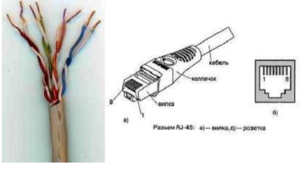

Для технологии Ethernet используется топология «звезда» с концентратором в центре, причем определены порты типа MDI (Medium Depended Interface, разъем сетевого адаптера) и MDIX (MDI crossing, разъем портов сетевого концентратора).

При соединении MDI-MDIX (подключение конечных узлов сети к портам активного оборудования) используется «прямой» кабель. При соединении MDI-MDI (непосредственное соединение адаптеров компьютеров) или MDIX-MDIX (соединение двух коммуникационных устройств) используют «перекрестный» (кроссовый) кабель.

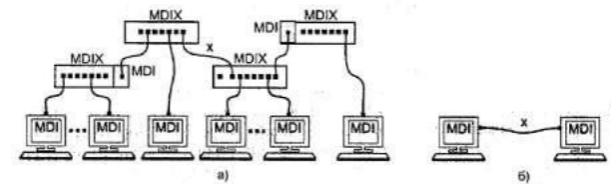

Большинство современных коммутаторов используют функцию автоопределения типа кабеля (MDI или MDIX), что почти исключает вероятность ошибочного подсоединения.

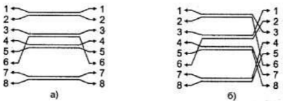

В 10- и 100-мегабитном Ethernet'e (10BaseT/100BaseTX) названия контактов содержат символы TX (transmitter, передатчик), RX (receiver, приемник) со знаками «+» и «—» и из 8 жил используется только половина; для Gigabit Ethernet (1000BaseTX) используются все 8 медных жил (обмен данными по 4 парам жил в обоих направлениях одновременно), подсоединение соответствует таблице.

**Таблица 1.1. Разъем RJ-45 адаптера Ethernet**

| Контакт | 10BaseT/100BaseTX | 1000BaseTX |
|---------|-------------------|------------|
| 1 | TX+ | BI_D1+ |
| 2 | TX- | BI_D1- |
| 3 | RX+ | BI_D2+ |
| 4 | не подсоединен | BI_D3+ |
| 5 | не подсоединен | BI_D3- |
| 6 | RX- | BI_D2- |
| 7 | не подсоединен | BI_D4+ |
| 8 | не подсоединен | BI_D4- |

Сигналы по каждой двухпроводной линии передаются дифференциальным способом (с противоположной полярностью по линиям «+» и «-»), причем входные и выходные цепи сетевых адаптеров имеют гальваническую развязку.

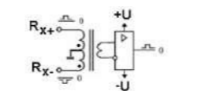

Кабель UTP соединяется с вилкой RJ-45 без применения пайки. При монтаже вилки RJ-45 на кабель UTP-5 удаляют внешнюю оболочку кабеля на длину 12,5 мм. Для удаления оболочки на специальном инструменте имеется специальный нож и ограничитель длины удаляемой оболочки. Снимать изоляцию с жил не нужно, однако жилы следует расположить на плоскости в соответствие со схемой заделки.

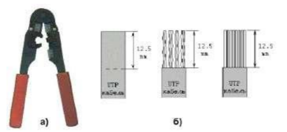

Варианты заделки проводов (разводка проводов витой пары) показаны ниже («прямой» кабель). В качестве схем заделки для 8-жильного кабеля равноценно можно использовать схему 568A или 568B (но одинаковую для данной сети, рекомендуется первая), для 4-жильного кабеля используется схема согласно рисунку.

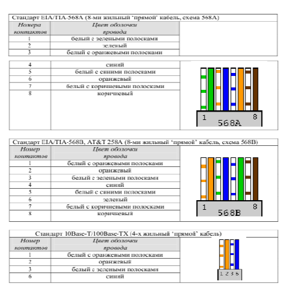

После описанного расположения жил на плоскости следует повернуть вилку контактами к себе и аккуратно надвинуть на кабель до упора, чтобы провода прошли под контактами.

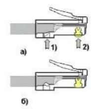

В крайнем случае (если нет обжимного инструмента) можно обжать разъем RJ-45 тонкой отверткой. При этом следует утопить все 8 шт. контактов (1) в корпус, а затем утопить и фиксатор провода (3). Полезно подложить что-либо под разъем, чтобы не сломать его фиксатор (2). Это не есть самый надежный способ монтажа, но приемлемый.

Для непосредственного соединения двух компьютеров можно рекомендовать показанное ниже соединение («перекрестный» кабель), приведен вариант 4-жильного так называемого «нуль-модемного кабеля».

**В случае использования 8-ми жильного кабеля соединение такое:**

**Второй вариант монтажа 8-ми жильного кабеля:**

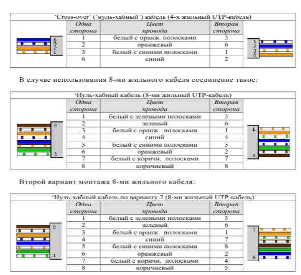

При тщательном выполнении монтажа вилок RJ-45 достигается устойчивый контакт между жилами кабеля и контактами вилки. В редких случаях (выявляемых обычно уже на этапе настройки программного обеспечения поддержки сети) требуется проверка физического соединения портов (выполняется с помощью кабельных тестеров или просто омметром).

Розетка представляет собой гнездо (разъем) соединителя с каким-либо приспособлением для крепления кабеля и корпусом для удобства монтажа, обычно в комплекте поставляется и вилка. Внешняя розетка представляет собой небольшую пластмассовую коробочку, к которой прилагается шуруп и двухсторонняя наклейка для монтажа на стену. Такая розетка служит окончанием сетевого кабеля, обычно разводимого по стене помещения и помещенного в коробах. В так называемых розетках типа KRONE для монтажа кабеля UTP-5 используется специальная пластина с щелью, в которую заталкивается провод, при этом прорезается изоляция и жила кабеля входит в надежный контакт с пластиной (пайка не применяется). Для монтажа проводов имеется специальный инструмент, который помимо заталкивания проводов в щель обрезает лишние его куски. В любом случае настоятельно рекомендуется после тщательного замера длины кабеля оставить по 1-1,5 м с каждой стороны для монтажа и укладки части кабеля в непосредственной близи от компьютера (или иного сетевого устройства).

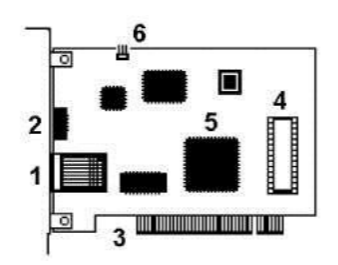

Для определения точки назначения пакетов в сети Ethernet используется т.н. MAC (Media Control Access)-адрес. Это уникальный серийный номер, присваиваемый каждому сетевому устройству Ethernet для идентификации его в сети. MAC-адрес присваивается адаптеру его производителем, но может быть изменен программно. В обычном режиме работы сетевые адаптеры просматривают весь проходящий сетевой трафик и ищут в каждом кадре свой MAC-адрес. Если такой находится, то устройство (адаптер) обрабатывает этот кадр. MAC-адрес имеет длину 6 байт (48 бит) и обычно записывается в шестнадцатеричном виде, например, 12:34:56:78:90:AB (двоеточия между байтами делают число более читабельным).

Каждый производитель присваивает адреса из принадлежащего ему диапазона адресов. Первые три байта адреса определяют производителя, например:

| Префикс | Производитель |
|---------|---------------|
| 00000C | Cisco |
| 00000E | Fujitsu |
| 00001D | Cabletron |
| 00004C | NEC Corporation |
| 000061 | Gateway Communications |
| 000062 | Honeywell |
| 0080C8 | D-Link |
| 00A024 | 3Com |
| 00C049 | US Robotics |

Обычно все поддерживающие высшие скорости обмена данными сетевые адаптеры работают и на меньших скоростях (если комплементарное устройство не поддерживает данной скорости, но совместимо по стандарту Ethernet). Позволяет это протокол согласования режимов (auto negotiation, процесс основан на обмене специальными служебными импульсами), выполняемый каждый раз при установлении соединения после физического подключения (при инициализации портов) и позволяющий выбрать наиболее эффективный из режимов, доступных обоим портам.

Для обеспечения корректной работы каждой сетевой платы необходимо определить для нее адрес ввода-вывода (In/Out port) и номер прерывания (IRQ). Конфигурирование сетевой платы заключается в настройке ее на свободные адрес и прерывание, которые затем будут использоваться операционной системой. Адрес (In/Out port) и прерывание (IRQ) для каждой сетевой платы должно быть отличным от других устройств компьютера. Современные сетевые карты поддерживают технологию Plug-and-Play и автоматически выполняют эту операцию. Программная поддержка сетевых карт обеспечивается драйверами, для операционной системы Windows возникновение проблем с драйверами маловероятно.

---

## Контрольные вопросы для самопроверки

1. Какие сетевые кабели использует технология Ethernet? Что такое кабель UTP? В чем его достоинства и недостатки?
2. Что такое сетевые устройства MDI и MDIX? Для соединения каких устройств необходим «перекрестный» (кроссированный) кабель?
3. Почему при монтаже вилки RJ-45 на кабель нет необходимости снимать изоляцию с отдельных жил кабеля?
4. Что такое «нуль-модемный» кабель и для каких целей он применяется?
5. Каким образом однозначно идентифицируются сетевые адаптеры? С какой целью введена возможность изменения MAC-адреса?
6. В чем заключается процесс конфигурирования сетевой платы? Какие параметры при этом настраиваются?

---

## Задание к лабораторной работе

Студент получает задание на выполнение работы; типовыми заданиями являются:

- Смонтировать UTP-кабель для соединения ПК с сетевым устройством (концентратором, коммутатором).
- Смонтировать UTP-кабель для непосредственного соединения двух ПК.

---

## Методические указания и порядок выполнения работы

Монтаж предполагает разделку концов кабеля в соответствие с поставленной целью (причем преподавателем может быть предложен как 4-, так и 8-жильный UTP-кабель), обжим вилки RJ-45, проверка контакта осуществляется кабельным тестером или омметром и проверяется преподавателем.

Сетевая карта устанавливается в свободный разъем на системной плате ПК (если на последней не имеется встроенного сетевого адаптера), при включении ПК конфигурируется технологией Plug-and-Play. Используемые адреса ввода-вывода (In/Out port) и номер прерывания (IRQ) фиксируются. Сетевой кабель подсоединяется к заданным устройствам.

---
# проверка 

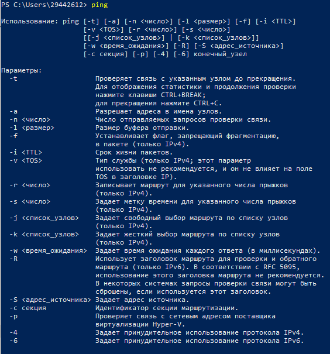

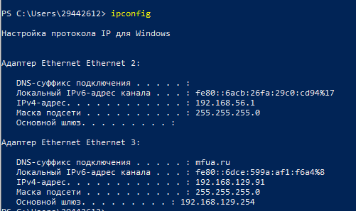
---

## Требования к отчету и защите

В отчете указываются параметры выполняемого задания (соединяемые сетевые устройства, тип кабеля, число жил) и выбранные студентом схемы соединения. Приводятся эскизы зачистки оболочки кабеля, последовательность расположения жил при монтаже вилки RJ-45, обжимного инструмента. Необходимо указать модель сетевой карты (при возможности определить MAC-адрес и по нему фирму-изготовителя) и поддерживаемые скорости обмена данными, тип шины данных. При возникновении проблем с контактом в кабеле следует привести схему проверки надежности контакта.

На защите проверяются приобретенные знания теоретического и практического материала по ответам на контрольные вопросы для самопроверки.

---
# Справочный материал

## Категории витой пары (UTP)

| Категория | Полоса пропускания | Кол-во пар | Пропускная способность, Мбит/с | Применение |
|-----------|-------------------|------------|-------------------------------|------------|
| CAT1 | 0,1 МГц | 1 | до 1 Мбит/с | телефония, для данных необходим модем |
| CAT2 | 1 МГц | 2 | до 4 Мбит/с | иногда встречается в телефонных сетях |
| CAT3 | 16 МГц | 2, 4 | 10 (10BASE-T), 100 (100BASE-T4) | подходит для передачи голоса и данных |
| CAT4 | 20 МГц | 4 | 10 (10BASE-T), 100 (100BASE-T4) | практически не используется |
| CAT5 | 100 МГц | 4 | 100 (100BASE-TX) | телефония, Fast Ethernet |
| CAT5e | 125 МГц | 4 | 100 (100BASE-TX), 1000 (1000BASE-TX) | Fast Ethernet и Gigabit Ethernet |
| CAT6 | 250 МГц | 4 | 1000 (1000BASE-TX) | Fast Ethernet и Gigabit Ethernet |
| CAT6A | 500 МГц | 4 | 1000 (1000BASE-TX) до 10 Гбит/с | Fast Ethernet и Gigabit Ethernet |
| CAT7 | 700 МГц | 4 | до 100 Гбит/с | Fast Ethernet и Gigabit Ethernet |

### Упрощенная таблица категорий витой пары

| Категория | Полоса пропускания | Описание |
|-----------|-------------------|----------|
| CAT1 | 0,1 МГц | 1 пара, телефонная связь (в России «лапша») |
| CAT2 | 1 МГц | 2 пары, сети до 4 Мб/с |
| CAT3 | 16 МГц | 4 пары, сети 10 и 100 Мб/с |
| CAT4 | 20 МГц | 4 пары, сети до 16 Мб/с |
| CAT5 | 100 МГц | 4 пары, сети 100 Мб/с (используется 2 пары) |
| CAT5e | 125 МГц | 4 пары, 100 Мб/с (2 пары), 1 Гб/с (4 пары) |
| CAT6 | 250 МГц | 4 пары, 1-10 Гб/с |
| CAT7 | 600 МГц | 4 пары, только экранированный, до 10 Гб/с |

---

## Разъем RJ-45 и его особенности

**Важное примечание:** Часто термин «RJ-45» ошибочно употребляется для именования разъёма **8P8C**, который используется для построения ЛВС. В то время как стандарт RJ-45 (точнее, RJ45S) использует разъём 8P4C с ключом, который физически несовместим с разъёмом 8P8C.

Ошибочное употребление термина «RJ-45» вызвано, вероятно, тем, что стандарт RJ-45S не получил широкого применения, а также внешним сходством разъёмов.

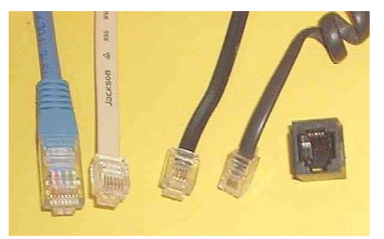

### Виды штекеров (слева направо)

| Тип разъема | Количество контактов | Стандарт | Применение |
|-------------|---------------------|----------|------------|
| 8P8C | 8 | «RJ-45» (ошибочно) | основной штекер, используемый при организации ЛВС |
| 6P6C | 6 | RJ-25 | телефонные сети |
| 6P4C | 4 | RJ-14 | телефонные сети, часто используется вместо 6P2C в RJ-11 |
| 4P4C | 4 | «RJ-9» | подключение телефонных трубок |

> **Примечание:** Средние два штекера (6P6C и 6P4C) могут быть вставлены в одну и ту же стандартную 6-контактную розетку.

В интернете часто путают RJ45 с коннектором 8P8C. Правильно называть именно 8P8C, а не RJ45. В частности, RJ45 (правильнее RJ45S) имеет совсем другой вид и всего лишь 4 жилы, а предназначен для подключения модемов.

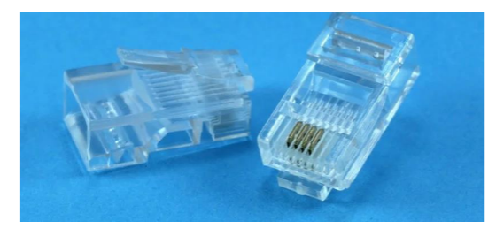

Проблема ещё в том, что в некоторых маршрутизаторах, коммутаторах входы имеют название «RJ45», но это в корне неверно. Но именно с помощью этого интерфейса и происходит подключение сетевых устройств. Например, роутера и всех домашних устройств: компьютеров, ноутбуков, телевизоров и т.д.

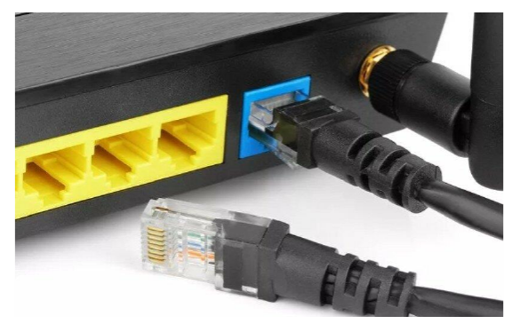

**Витая пара** — кабель называется так, потому что внутри кабеля есть 4 пары (8 шт.) проводков, которые скручены между собой. Это необходимо, чтобы защитить передаваемые данные от электромагнитного воздействия.

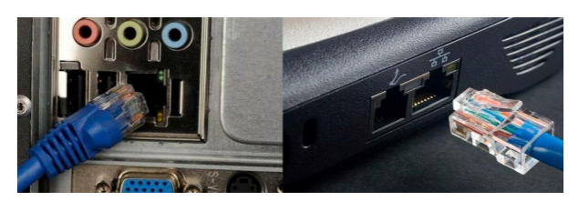

---

## Основные схемы обжимки

### Прямой кабель (Компьютер – Коммутатор/Роутер)

Данную схему часто называют «Компьютер – Компьютер», хотя на самом деле её применяют для подключения: роутеров, свитчей, телевизоров, сетевых принтеров и многих других сетевых устройств. В том числе её постоянно используют для подключения интернета.

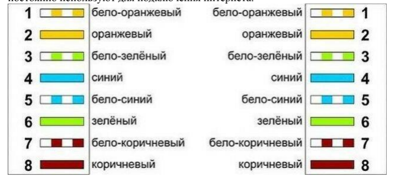

Почти везде при подключении используется именно **«В» цветовая схема**.

**Порядок обжимки Ethernet (распиновка по схеме «В»):**

| № контакта | Цвет жилы |
|------------|-----------|
| 1 | Бело-оранжевый |
| 2 | Оранжевый |
| 3 | Бело-зелёный |
| 4 | Синий |
| 5 | Бело-синий |
| 6 | Зелёный |
| 7 | Бело-коричневый |
| 8 | Коричневый |

> **Важно:** Нужно абсолютно одинаково обжать оба конца кабеля.

### Перекрестная схема «А» (Кросс-овер)

Один конец обжимается по стандартной схеме «В», а второй использует другую цветовую схему.

### «Ленивая обжимка» (2 пары)

Данную распиновку используют очень часто, так как она достаточно простая. Схема используется только при подключении устройств и сетевого оборудования, которому не нужно использовать скорость выше 100 Мбит/сек.

| Характеристика | 8 жил (4 пары) | 4 жилы (2 пары) |
|----------------|----------------|-----------------|
| Максимальная скорость | 1000 Мбит/сек (1 Гбит/сек) | 100 Мбит/сек |
| Количество используемых пар | 4 | 2 |

**Важные замечания:**
- При обжимке 4 пар сетевой кабель может передавать данные со скоростью 1000 Мбит/сек.
- Если использовать всего 2 пары, то скорость падает до 100 Мбит/сек.
- В большинстве случаев таких параметров достаточно, но с ростом скорости и потока обмена информацией в организациях возможностей 100 Мбит/сек не хватит, и потребуется переобжимать все кабели на стандартную схему.
- В итоге будет сделана двойная или даже лишняя работа.
- То же самое касается и домашней сети при замене роутера 100 Мбит на новый с поддержкой 1 Гбит/сек. Если ранее была распиновка на 2 пары, то необходимо будет все переобжимать. В худшем случае — замена 4-жильного кабеля на 8-жильный.

---

## Пошаговая инструкция обжимки кабеля

1. **Снимаем верхнюю оплетку.**

2. **Аккуратно располагаем все провода в нужном порядке** по схеме, которая указана выше. Считаем слева направо от 1-го до 8-го провода.

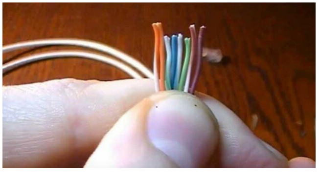

3. **Очень внимательно и аккуратно на глаз отрезаем лишнюю часть проводов** так, чтобы они были все на одном уровне.

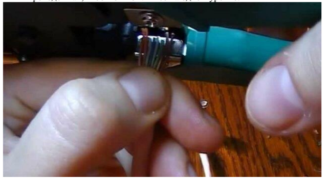

4. **Располагаем коннектор металлическими жилами вверх** и аккуратно вставляем проводки таким образом, чтобы каждый попал в свой желобок.

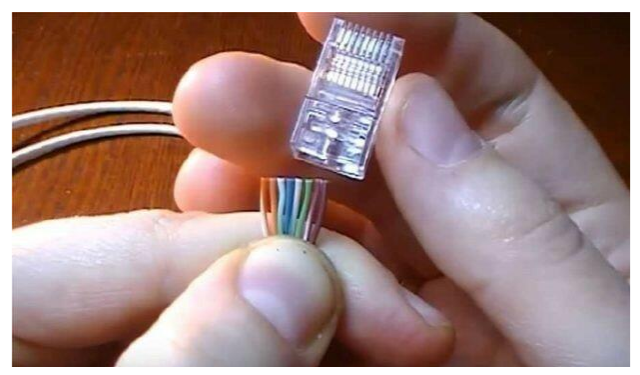

5. **Убеждаемся, что каждый провод достает до металлических жил коннектора**, которые будут потом использоваться при «спайке». Желательно, чтобы основная оплетка также была максимально внутри самого коннектора.

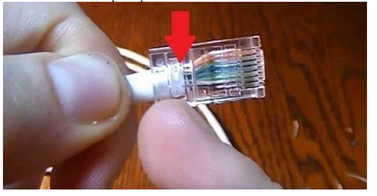

6. **Берем щипцы для обжимки** и один раз хорошо их зажимаем.

7. **Проделываем все вышеперечисленные пункты с другим концом.**

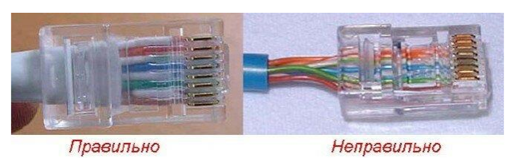

---

## Проверка подключения (LAN-тестер)

После обжима витой пары по выбранной схеме необходимо проверить подключение. Для этого лучше всего использовать специальное устройство **LAN-тестер**.

**Порядок проверки:**
1. Включаем устройство.
2. Подключаем к одному концу кабеля одну часть аппарата.
3. Подключаем вторую часть ко второму концу кабеля.
4. Анализируем индикацию:
   - Если индикаторы всех жил просветились в правильном порядке — обжимка выполнена верно.
   - Если какой-то из индикаторов проводов не горит или мигнул неправильно — требуется переобжимка кабеля.

---

## MAC-адреса производителей сетевых устройств

MAC-адрес имеет длину 6 байт (48 бит) и обычно записывается в шестнадцатеричном виде, например, `12:34:56:78:90:AB`.

Первые три байта адреса определяют производителя:

| Префикс MAC-адреса | Производитель |
|--------------------|---------------|
| 00000C | Cisco |
| 00000E | Fujitsu |
| 00001D | Cabletron |
| 00004C | NEC Corporation |
| 000061 | Gateway Communications |
| 000062 | Honeywell |
| 0080C8 | D-Link |
| 00A024 | 3Com |
| 00C049 | US Robotics |

---

## Стандарты Ethernet

| Стандарт | Год принятия | Скорость | IEEE спецификация |
|----------|-------------|----------|-------------------|
| Ethernet | 1980 (Ethernet I), 1985 (Ethernet II/DIX) | 10 Мбит/с | IEEE 802.3 |
| Fast Ethernet | 1995 | 100 Мбит/с | IEEE 802.3u |
| Gigabit Ethernet | 1998 | 1000 Мбит/с | IEEE 802.3z |
| 10 Gigabit Ethernet | 2002 | 10 Гбит/с | IEEE 802.3ae |

### Метод доступа CSMA/CD
Carrier Sense Multiple Access with Collision Detection — метод коллективного доступа с опознаванием несущей и обнаружением коллизий. Используется в Ethernet и Fast Ethernet.

---

## Типы портов

| Обозначение | Расшифровка | Описание |
|-------------|-------------|----------|
| MDI | Medium Depended Interface | разъем сетевого адаптера |
| MDIX | MDI crossing | разъем портов сетевого концентратора |

**Типы соединений:**
- **MDI — MDIX** → прямой кабель (подключение конечных узлов к активному оборудованию)
- **MDI — MDI** или **MDIX — MDIX** → перекрестный (кроссовый) кабель

> **Примечание:** Большинство современных коммутаторов используют функцию автоопределения типа кабеля (Auto MDI/MDIX), что почти исключает вероятность ошибочного подсоединения.

---

## Технические характеристики кабеля UTP категории 5

| Параметр | Значение |
|----------|----------|
| Количество жил | 8 (4 пары) |
| Материал жил | медь |
| Активное сопротивление | не более 9,4 Ом на 100 м |
| Волновое сопротивление | 100 Ом на частоте 100-120 МГц |
| Затухание сигнала | 0,8-22 дБ на частоте 100 МГц |

**Цветовая маркировка пар:**
- Пара 1: синий + белый с синей полоской
- Пара 2: оранжевый + белый с оранжевой полоской
- Пара 3: зеленый + белый с зеленой полоской
- Пара 4: коричневый + белый с коричневой полоской

---

## Конфигурирование сетевой платы

Для обеспечения корректной работы каждой сетевой платы необходимо определить:

| Параметр | Описание |
|----------|----------|
| Адрес ввода-вывода (In/Out port) | адрес для обмена данными с процессором |
| Номер прерывания (IRQ) | линия прерывания для уведомления процессора |

> **Примечание:** Современные сетевые карты поддерживают технологию **Plug-and-Play** и автоматически выполняют эту операцию.

---

## Рекомендации по монтажу

- При монтаже вилки RJ-45 на кабель UTP-5 удаляют внешнюю оболочку кабеля на длину **12,5 мм**.
- Снимать изоляцию с жил **не нужно**.
- Для монтажа проводов рекомендуется оставлять по **1-1,5 м** кабеля с каждой стороны для монтажа и укладки.
- При отсутствии обжимного инструмента можно обжать разъем RJ-45 тонкой отверткой (менее надежный способ).