# Лабораторная работа № 2
## Изучение программных средств тестирования и определения параметров настройки в компьютерных сетях

**Цель работы:** приобретение знаний и практических навыков в использовании программного обеспечения для настройки и тестирования компьютерной сети.

**Материалы, оборудование, программное обеспечение:** лаборатория, оснащенная персональными компьютерами, объединенными в локальную сеть с доступом в Интернет, утилиты сканирования беспроводных сетей.

**Критерии положительной оценки:** выполнение типовых заданий, оформление отчета по работе, ответы на вопросы для самопроверки.

## Планируемое время выполнения:

Аудиторное время выполнения (под руководством преподавателя): 6 часов.

Время самостоятельной подготовки: 2 часа.

## Теоретическое введение

Для тестирования параметров (маршрут и скорость передачи данных) соединения с глобальной сетью Интернет, а также проверки правильности сетевых настроек имеется большое количество программных средств. Например, в операционной системе MS Windows – это встроенные компьютерные программы – утилиты, которые позволяют оценить надежность соединения и ряд других важных параметров.


## Задания к лабораторной работе

Студент получает типовые задания на выполнение работы.

1. Ознакомиться с функциональными возможностями программного обеспечения для настройки и тестирования компьютерной сети.

2. Выполнить рассмотренные сетевые утилиты.

3. Полученные результаты занести в отчет по лабораторной работе.

## Задание 1

Определить IP-адрес локального (своего) компьютера, подключенного к сети.

Для определения IP-адреса своего компьютера в операционной системе MS Windows необходимо воспользоваться утилитой IPCONFIG. Для запуска данной программы необходимо выполнить команду ipconfig в режиме командной строки. При выполнении данной команды на экране монитора компьютера будет выведена основная конфигурация TCP/IP для всех сетевых адаптеров (см. рис. 2.1).

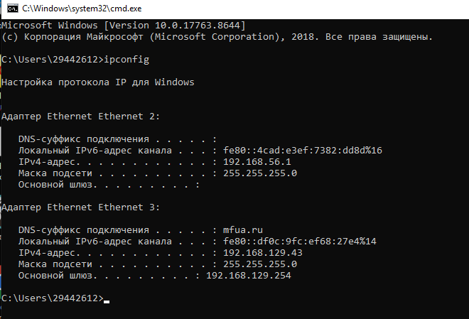

Для получения более полной информации выполните команду ipconfig /all.

## Задание 2

Определить имя узла компьютера в локальной сети.

Для определения имени узла компьютера в локальной сети необходимо использовать утилиту HOSTNAME. После выполнения команды hostname в режиме командной строки на экран монитора выводится информация об имени узла компьютера в локальной сети (см. рис. 2.2.).

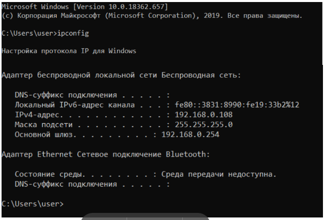

## Задание 3

Определить скорость передачи информации в компьютерной сети и наличие связи с узлом.

Проверить наличие пути до заданного узла и определить временные характеристики этого пути можно, используя утилиту PING, которая тестирует сетевое соединение путем посылки ICMP-пакетов типа «запрос эха», на которые получатель отвечает ICMP-пакетом типа «эхо-ответ». Утилите PING достаточно указать IP-адрес или DNS-имя, однако имеется ряд ключей, позволяющих более тонко управлять ее работой (перечень выводится на экран без указания в утилите IP-адреса или DNS-имени). Утилита PING выводит результат каждого запроса/ответа на отдельной строке, а перед завершением работы выдает статистику: минимальное, максимальное и среднее время передачи пакета, количество и долю потерянных пакетов. Фактически PING является основной утилитой при тестировании сетевых соединений.

При использовании утилиты PING совместно с ключом «-t» можно для тестирования скорости передачи информации отправлять в сеть неограниченное число пакетов. Например, при выполнении в командной строке команды ping –t ip_address (ключ –t отделяется пробелом от команды ping, ip_address – IP-адрес (или DNS-имя) компьютера, который используется для тестирования связи), будет происходить постоянная отправка пакетов и можно обнаружить ситуацию, при которой появляется или пропадает связь.

Если ответ не пришел в течение определенного времени, то считается, что между двумя устройствами отсутствует линия связи. Если в командной строке ввести команду ping 127.0.0.1 (127.0.0.1 — IP-адрес специального сетевого интерфейса в сетевом протоколе TCP/IP и обозначает, то же самое сетевое устройство (компьютер), с которого осуществляется отправка сетевого пакета или установление соединения). Использование адреса 127.0.0.1 позволяет устанавливать соединение и передавать информацию для программ-серверов, работающим на том же компьютере, что и программа-клиент, независимо от конфигурации аппаратных сетевых средств компьютера.

Это дает возможность протестировать корректность работы самой утилиты (см. рис. 2.3).

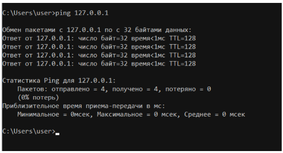

Обычно для тестирования скорости передачи информации отправляется 4 пакета.

Для проверки наличия связи с узлом KLGTU.RU введем команду ping klgtu.ru (см. рис. 2.4).
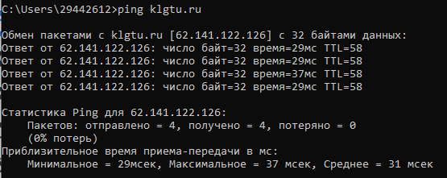
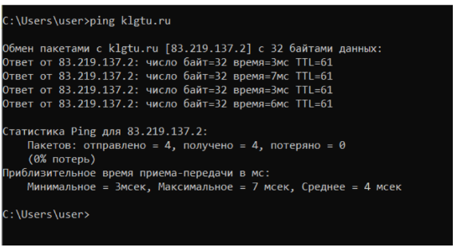

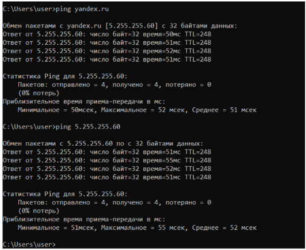

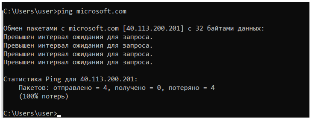

## Задание 4

Определить маршрут пакетов до заданного узла и получить временные характеристики для каждого промежуточного маршрутизатора на этом пути.

Выявлять последовательность маршрутизаторов, через которые проходит IP-пакет на пути к пункту своего назначения и время задержки на каждом из них позволяет утилита TRACERT. Для выполнения утилиты необходимо указать IP-адрес или DNS-имя конечного узла. Более тонко управлять ее работой позволяют ключи (перечень выводится на экран без указания в утилите IP-адреса или DNS-имени). Утилита, как и ранее описанная PING, отправляет серию пакетов ICMP с разными значениями TTL (Time to live). В вычислительной технике и компьютерных сетях — предельный период времени или число итераций, или переходов, за который набор данных (пакет) может существовать до своего исчезновения.

Для каждого пакета на экране отображается величина интервала времени между отправкой пакета и получением ответа. Символ «*» означает, что ответ на данный пакет не был получен. Если узел не отвечает, то при превышении интервала ожидания ответа выдается сообщение «Превышен интервал ожидания для запроса». Интервал ожидания ответа может быть изменен с помощью ключа «–w» команды TRACERT. Для трассировки маршрута до узла KLGTU.RU выполним команду tracert klgtu.ru (см. рис. 2.7).

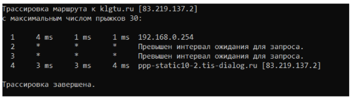

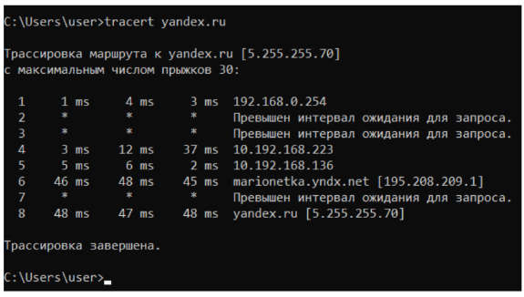

## Задание 5

Определить соответствие локального IP-адреса, физическому (аппаратному) адресу в локальной сети.

Возможность просматривать и изменять ARP-таблицу, в которой хранятся пары «MAC-адрес - IP-адрес» для тех узлов, с которыми в недавнем происходил обмен данными, дает утилита ARP. Эта таблица формируется автоматически при работе сетевого узла, но администратор сети может вносить в нее записи вручную.

Узел, собирающийся отправить сообщение другому узлу, должен предварительно узнать MAC адрес получателя сообщения. Для решения данной задачи узел применяет технологию ARP, отправляя запрос узлам своей локальной сети. Данный ARP запрос содержит IP адрес получателя. Из всех узлов, получивших данный запрос, отвечает лишь тот, у кого соответствующий IP адрес. В своем ответе (ARP отклике) этот узел сообщает свой MAC адрес. И лишь после этого первый узел сможет отправить ему свое сообщение. Компьютеры чаще всего отправляют свои сообщения маршрутизатору и, следовательно, в своих ARP запросах они указывают адрес основного шлюза. Для уменьшения ARP трафика компьютеры хранят в своей памяти таблицу с IP и MAC адресами тех устройств, с которыми они в последнее время обменивались сообщениями. Управление работой утилиты возможно с помощью ключей (перечень выводится на экран командой arp). Утилита ARP с ключом -a позволяет вывести на экран всю ARP-таблицу. Выполним команду arp -a (см. рис. 2.9).

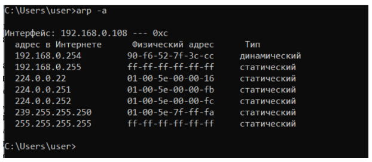

В данном случае мы видим, что у основного шлюза (192.168.0.254) MAC адрес равен 90-f6-52-7f-3c-cc.

## Задание 6

Wireless Network Watcher - бесплатная утилита, которая сканирует беспроводные сети и отображает список всех подключенных в данный момент компьютеров и устройств. Для каждого обнаруженного устройства отображается такая информация, как IP- и MAC-адрес, название компании производителя и имя компьютера или устройства. Скопируем утилиту на свой компьютер (прилагается к методическим указаниям) и выполним команду WNetWatcher.exe (см. рис. 2.10). Дополнительная информация (в столбцах, которые не показаны на рисунке) содержит сведения о времени и числе обнаружений устройства в сети, его активности в настоящий момент времени. Используя ранее изученную сетевую утилиту PING определить скорость передачи информации в компьютерной сети и наличие связи с подключенными устройствами (узлами) беспроводной сети (см. рис. 2.11).

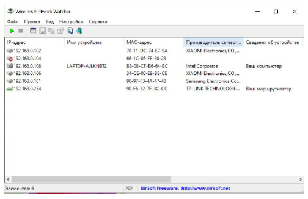

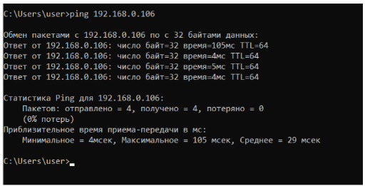

## Задание 7

WifiInfoView - небольшая бесплатная утилита, которая сканирует ближайшие беспроводные сети, и отображает массу полезной информации, как например имя сети (SSID), MAC-адрес, тип PHY (802.11 g/n), мощность и качество сигнала, используемая частота, номер канала, максимальная скорость, модель маршрутизатора, наличие или отсутствие пароля и многое другое. В нижней панели главного окна WifiInfoView отображается полученная информация, которая представлена в шестнадцатеричном формате. Также присутствует возможность группировать обнаруженные беспроводные сети по номеру канала, модели маршрутизатора, типу PHY или максимальной скорости. Скопируем утилиту на свой компьютер (прилагается к методическим указаниям) и выполним команду WifiInfoView.exe (см. рис. 2.12). Дополнительная информация отображается в столбцах, которые не показаны на рисунке.

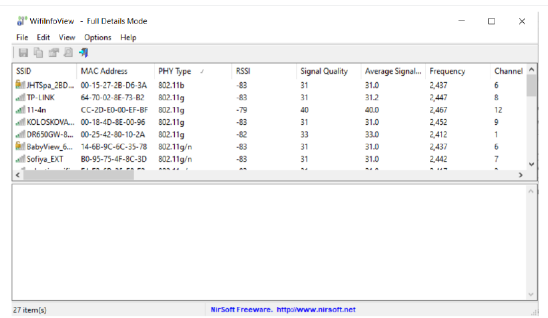

## Задание 8

Сайт 2ip.ru — это многофункциональный онлайн-сервис, который предоставляет возможность пользователям узнать свой IP-адрес, а также получить разнообразную информацию о сетевых соединениях, проверить скорость интернета, доступность сайтов и многое другое. Для получения информации о своем компьютере перейдем по ссылке https://2ip.ru (см. рис. 2.13).

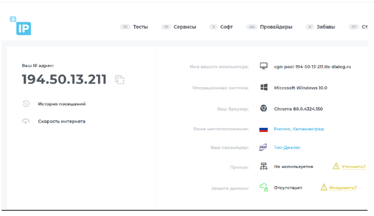

В меню «Тесты», которых в настоящий момент 32 шт., можно увидеть их список с коротким описанием. Все они могут пригодиться обычному пользователю и касаются, в основном, характеристик соединения его компьютера или мобильного гаджета с ресурсами Интернет.

В меню «Сервисы» предоставляются инструменты, которые пригодятся непосредственно при разработке веб-сайтов и построении стратегии их продвижения.

При изучении интернет-сервисов сайта 2ip.ru предлагается получить сведения о своем компьютере и информацию о сайте (выбирается самостоятельно).

## Требования к отчету и защите

В отчете указываются название, цель работы. Описание выполненных лабораторных заданий с результатами в виде скриншотов и выводами по каждому заданию.

На защите проверяются приобретенные знания теоретического и практического материала по ответам на контрольные вопросы для самопроверки.


---

## Ответы на контрольные вопросы для самопроверки

### 1. Какой формат имени сетевого ресурса может использоваться при обращении к нему?

При обращении к сетевому ресурсу могут использоваться следующие форматы имен:

- **DNS-имя (доменное имя)** — например, `klgtu.ru`, `yandex.ru`, `www.google.com`
- **IP-адрес** — например, `83.219.137.2`, `5.255.255.70`
- **UNC-путь (Universal Naming Convention)** — для доступа к сетевым папкам и файлам в локальной сети, например: `\\Server\SharedFolder\file.txt`
- **NetBIOS-имя** — используется в локальных сетях Windows, например: `\\COMPUTER_NAME`

---

### 2. Какой протокол необходим для работы с утилитой ping? Найти описание и характеристики протокола.

Для работы утилиты **ping** используется протокол **ICMP (Internet Control Message Protocol)** — протокол межсетевых управляющих сообщений.

**Описание и характеристики протокола ICMP:**

| Характеристика | Описание |
|----------------|----------|
| Назначение | Передача диагностических и управляющих сообщений об ошибках в IP-сетях |
| Уровень модели OSI | Сетевой уровень (уровень 3) |
| Инкапсуляция | Сообщения ICMP инкапсулируются непосредственно в IP-пакеты |
| Типы сообщений | Echo Request (запрос эха), Echo Reply (эхо-ответ), Destination Unreachable, Time Exceeded и др. |
| Использование ping | Утилита ping отправляет ICMP-пакеты типа Echo Request и ожидает Echo Reply |

**Основные характеристики:**
- Не используется для передачи пользовательских данных
- Служит для диагностики сети и сообщения об ошибках
- Не требует установления соединения (без установления соединения)
- Поле `TTL` (Time to live) ограничивает время жизни пакета

---

### 3. Зачем используется параметр all в утилите ipconfig?

Параметр **`/all`** в утилите `ipconfig` используется для отображения **полной конфигурации TCP/IP** для всех сетевых адаптеров.

**Дополнительная информация, выводимая с параметром `/all`:**

| Параметр | Описание |
|----------|----------|
| MAC-адрес (Physical Address) | Физический адрес сетевого адаптера |
| DHCP включен | Показывает, используется ли DHCP |
| Адрес DHCP-сервера | IP-адрес сервера, выдавшего настройки |
| Дата получения и окончания аренды | Для адресов, полученных по DHCP |
| DNS-серверы | Адреса используемых DNS-серверов |
| Основной шлюз (Default Gateway) | Адрес маршрутизатора для выхода в другие сети |
| NetBIOS over TCP/IP | Статус использования NetBIOS |

Без параметра `/all` команда `ipconfig` показывает только базовую информацию: IP-адрес, маску подсети и основной шлюз.

---

### 4. Каким образом утилиты ping и tracert осуществляют прослеживание маршрутов пакетов к заданному узлу?

**Утилита ping** — не предназначена для трассировки маршрута. Она только проверяет доступность узла и измеряет время прохождения пакетов, но не показывает промежуточные узлы.

**Утилита tracert** — осуществляет трассировку следующим образом:

1. **Отправка ICMP-пакетов с увеличивающимся TTL:**
   - Сначала отправляется пакет с `TTL = 1`. Первый маршрутизатор уменьшает TTL до 0, отбрасывает пакет и возвращает сообщение `Time Exceeded` (время превышено). Так определяется первый маршрутизатор.

2. **Увеличение TTL:**
   - Затем отправляется пакет с `TTL = 2`. Второй маршрутизатор возвращает сообщение о превышении времени. Так определяется второй маршрутизатор.

3. **Повторение до достижения цели:**
   - Процесс повторяется с `TTL = 3, 4, 5, ...` до тех пор, пока пакет не достигнет конечного узла.

4. **Определение конечного узла:**
   - Когда пакет достигает узла назначения, он возвращает `Echo Reply` (эхо-ответ), что сигнализирует о завершении трассировки.

5. **Измерение времени:**
   - Для каждого значения TTL отправляется 3 пакета, измеряется время ответа от каждого маршрутизатора.

**Схема работы:**
```
Отправитель -> Маршрутизатор 1 (TTL=1) -> Маршрутизатор 2 (TTL=2) -> ... -> Узел назначения
                  ↑ Time Exceeded         ↑ Time Exceeded              ↑ Echo Reply
```

---

### 5. Можно ли утилитой tracert задать максимальное число ретрансляций?

**Да, можно.** Для этого используется ключ **`-h`** (или **`--max-hops`** в некоторых версиях).

**Синтаксис:**
```
tracert -h число_ретрансляций адрес_узла
```

**Пример:**
```
tracert -h 15 yandex.ru
```

**Что делает этот параметр:**
- Задает максимальное количество прыжков (hop'ов, ретрансляций, маршрутизаторов) для поиска узла.
- По умолчанию максимальное число прыжков в Windows — 30.
- Если узел не найден за указанное число прыжков, трассировка прекращается.

**Другие полезные ключи tracert:**

| Ключ | Назначение |
|------|------------|
| `-h` | Максимальное число прыжков |
| `-w` | Интервал ожидания ответа в миллисекундах |
| `-d` | Запрещает преобразование IP-адресов в имена узлов (ускоряет работу) |
| `-4` | Использовать только IPv4 |
| `-6` | Использовать только IPv6 |

---

### 6. Что такое localhost?

**Localhost** — это стандартное имя (хоста) для обращения компьютера к самому себе через сетевой протокол.

**Основные характеристики:**

| Характеристика | Описание |
|----------------|----------|
| IP-адрес (IPv4) | `127.0.0.1` |
| IP-адрес (IPv6) | `::1` |
| Назначение | Обратная связь (loopback) — тестирование сетевых приложений без использования реальной сетевой карты |
| Физический интерфейс | Не требует наличия сетевой карты |

**Использование localhost:**
- **Тестирование сетевого стека:** команда `ping 127.0.0.1` или `ping localhost` проверяет корректность работы протокола TCP/IP на самом компьютере
- **Разработка веб-приложений:** веб-сервер на локальном компьютере доступен по адресу `http://localhost`
- **Доступ к локальным серверам:** базы данных, приложения могут обмениваться данными через localhost

**Пример:**
```
ping localhost
```
или
```
ping 127.0.0.1
```

Если команда выполняется успешно (приходят ответы), значит, сетевой стек TCP/IP работает корректно, даже если компьютер физически не подключен к сети.

---