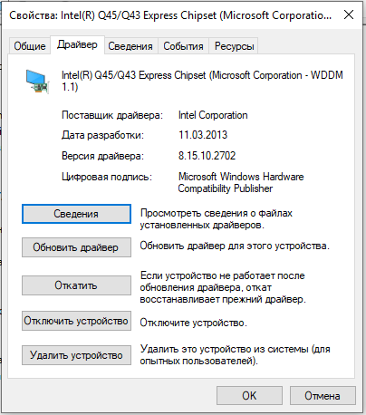
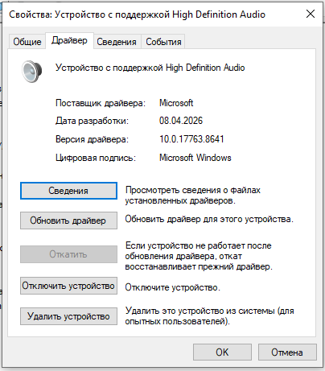
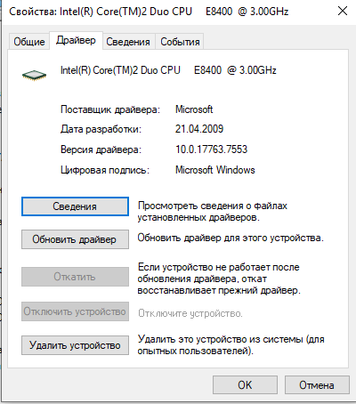
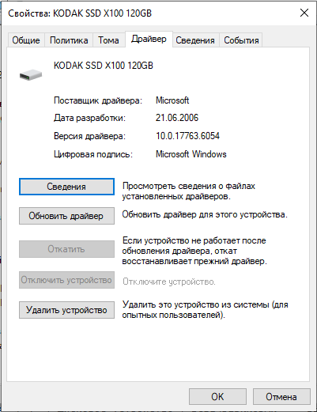
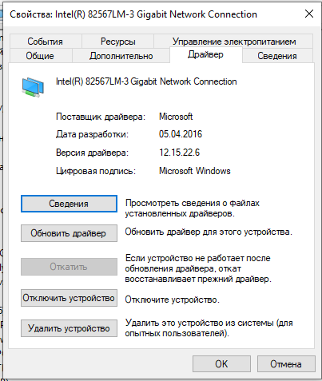

# Лабораторная работа 14
## Настройка и обновление драйверов

**Цель работы:** научиться использовать всевозможные средства поиска и настройки драйверов оборудования компьютера.

---

## Теоретические сведения

**Драйвер** — это программное обеспечение, через которое операционная система получает доступ к аппаратному обеспечению устройства.  
Драйверы для ключевых компонентов (например, процессора, дисков) обычно уже есть в системе. Для видеокарты, принтера, звуковой карты могут потребоваться специальные драйверы от производителя.

**ИД оборудования (Hardware ID)** — уникальный идентификатор, по которому система и программы могут точно определить модель устройства.  
Пример:  
`PCI\VEN_5333&DEV_8811&SUBSYS_00000000&REV_00`  
- **VEN** (Vendor) — код производителя.  
- **DEV** (Device) — код устройства.

---

## Выполнение работы

### 1. Определение ИД оборудования

Чтобы узнать ИД оборудования:

1. Нажмите правой кнопкой мыши на **Пуск** → выберите **Диспетчер устройств**.
2. Найдите нужное устройство (например, «Видеоадаптеры»).
3. Нажмите на него правой кнопкой → **Свойства**.
4. Перейдите на вкладку **Сведения**.
5. В выпадающем списке выберите **ИД оборудования** (или «Hardware Ids»).

Будет показан один или несколько идентификаторов — используйте первый.

---

### 2. Версия установленного драйвера

Всё в том же окне **Свойства** устройства:

1. Перейдите на вкладку **Драйвер**.
2. Посмотрите поле **Версия драйвера** — это и есть текущая версия.

---

### 3. Поиск новой версии драйвера по ИД

1. Скопируйте ИД оборудования (например, `PCI\VEN_8086&DEV_3E92`).
2. Вставьте его в поисковой строке браузера.
3. Добавьте слово `driver` или `download` (например, `PCI\VEN_8086&DEV_3E92 driver`).
4. Откройте официальный сайт производителя (Intel, NVIDIA, AMD, Realtek и др.) или проверенный сайт драйверов (например, driverpack.io, но лучше официальный).
5. Найдите новую версию **выше** текущей.
6. Сделайте скриншот найденной версии.

---

## Таблица результатов

| №  | Оборудование       | ID оборудования (Hardware ID) | Версия драйвера (установленная) | Новая версия драйвера (скриншот) |
|----|--------------------|-------------------------------|----------------------------------|----------------------------------|
| 1  | Видеоадаптер       | PCI\VEN_8086&DEV_2E12&SUBSYS_04201028&REV_03 | 8.15.10.2702 |  |
| 2  | Звуковое устройство | HDAUDIO\FUNC_01&VEN_11D4&DEV_194A&SUBSYS_10280420&REV_1004 | 10.0.17763.8641 |  |
| 3  | Процессор          | ACPI\GenuineIntel_-_Intel64_Family_6_Model_23 | 10.0.17763.7553 |  |
| 4  | Дисковое устройство | SCSI\DiskKODAK_____SSD_X100_120GBHAFE | 10.0.17763.6054 |  |
| 5  | Сетевой адаптер    | PCI\VEN_8086&DEV_10DE&REV_02 | 12.15.22.6 |  |

> **Примечание:**  
> - Для **процессора** ИД можно посмотреть в его свойствах, но драйверы для процессора обычно обновляются через обновления Windows (или чипсет).  
> - Для **дискового устройства** (SSD/HDD) драйвер часто стандартный от Microsoft — новая версия может отсутствовать.  
> - Для **сетевого адаптера** (Wi-Fi/Ethernet) — драйверы часто обновляются.

---

## Контрольные вопросы

### 1. Что такое драйвер?
**Драйвер** — это программа, которая позволяет операционной системе управлять устройством (видеокартой, принтером, звуковой картой и т.д.). Без драйвера устройство либо не работает, либо работает неправильно.

### 2. Что такое ИД оборудования и расшифровка параметров?
**ИД оборудования** — уникальный идентификатор, по которому можно точно определить производителя и модель устройства.  
- **VEN** (Vendor) → код производителя.  
- **DEV** (Device) → код устройства.  
Пример: `VEN_8086` — Intel, `DEV_3E92` — определённая модель видеоядра.