# Лабораторная работа №15

## Установка и настройка центра обновления Windows

**Цель:** Изучить принципы настройки и обновления ОС Windows

**Теоретические сведения:**

Обновления делятся на важные, рекомендуемые, необязательные и основные.

Это означает следующее:

- *Важные обновления* обеспечивают значительное улучшение защиты, безопасности и надежности компьютера. Они должны устанавливаться сразу после их появления и устанавливаются автоматически с помощью Windows Update.
- *Рекомендуемые обновления* могут касаться некритических проблем и улучшать работу компьютера. Хотя такие обновления не касаются основных аспектов работы компьютера или программ Windows, они часто содержат существенные улучшения. Эти обновления могут установиться автоматически.
- *Необязательные обновления* содержат непосредственно обновления, драйверы и другие программы от Майкрософт, призванные улучшить работу компьютера. Установить их нужно вручную.

В зависимости от **типа обновления Windows Update** обеспечивает:

- *Обновление безопасности*. Распространяемое исправление уязвимостей определенных продуктов в системе безопасности. Уязвимости в безопасности оцениваются на основе их опасности, которая обозначается в бюллетене Майкрософт как критическая, важная, средняя или низкой степени важности.
- *Критические обновления*. Распространяемое исправление уязвимостей определенных программ, направлено на устранение ошибок, не связанных с безопасностью.
- *Пакеты обновлений*. Проверенные сборные наборы исправлений, обновлений безопасности, критических обновлений и обычных обновлений, а также дополнительные исправления ошибок, найденных со времени выхода продукта. Пакеты обновлений могут содержать некоторые изменения в дизайне и функциональности программ.

**Задание на лабораторную работу:**

1.  **Настройте центр обновления Windows 10 (пуск -> параметры->обновление и безопасность)**

    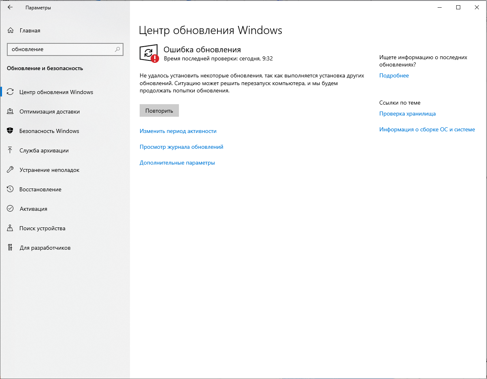

2.  Проверьте наличие новых обновлений

    

    *Если центр обновления выдает ошибку, проверьте способ подключения виртуальной машины к интернету*

    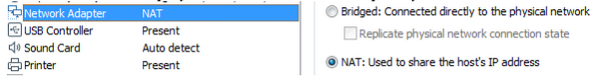

    *Или обратитесь к преподавателю*

3.  Зафиксируйте какие обязательные обновления могут быть установлены

4.  Просмотрите и зафиксируйте необязательные обновления

5.  Дождитесь скачивания и установки хотя бы нескольких обновлений. Зафиксируйте их установку в отчете, для этого обратитесь к журналу обновлений

    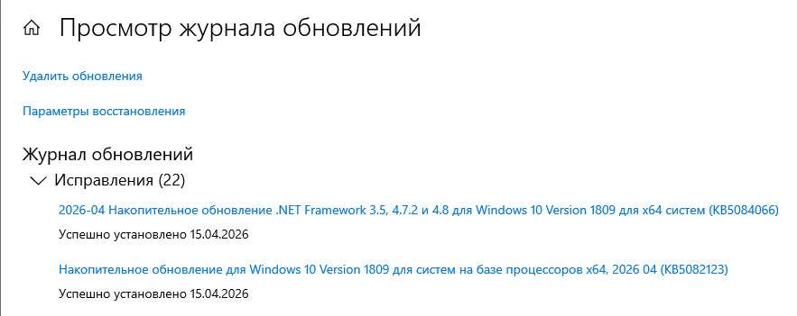

6.  **Отключение обновлений Windows 10**

    1.  Запустите редактор локальной групповой политики (нажать Win+R, ввести *gpedit.msc*)
    2.  Перейдите к разделу «Конфигурация компьютера» --- «Административные шаблоны» --- «Компоненты Windows» --- «Центр обновления Windows». Найдите пункт «Настройка автоматического обновления» и дважды кликните по нему.

        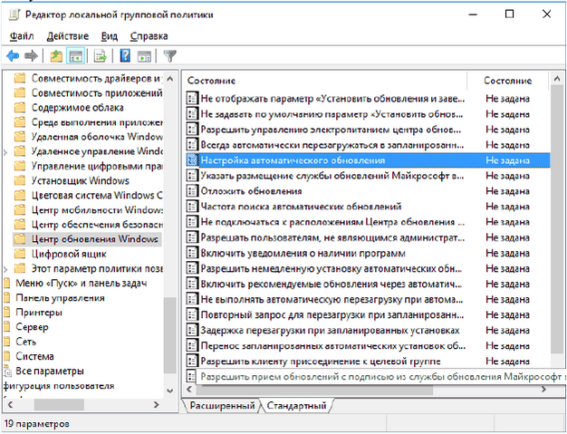

    3.  В окне настройки установите «Отключено» для того, чтобы Windows 10 никогда не проверяла и не устанавливала обновления.

        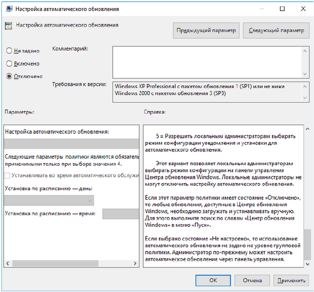

    Закройте редактор, после чего зайдите Центр обновления Windows и зафиксируйте изменения в центре.

7.  **Установите обновления из папки «Обновления к установки» в ручную и выясните тип установленных обновлений**

    Для того чтобы скопировать обновления из сетевой папки, на виртуальной машине откройте проводник и в строке пути пропишите [\\\\kbastrikin](file:///\\kbastrikin)

    Для поиска типа установленных обновлений используйте сайт <http://www.catalog.update.microsoft.com>

    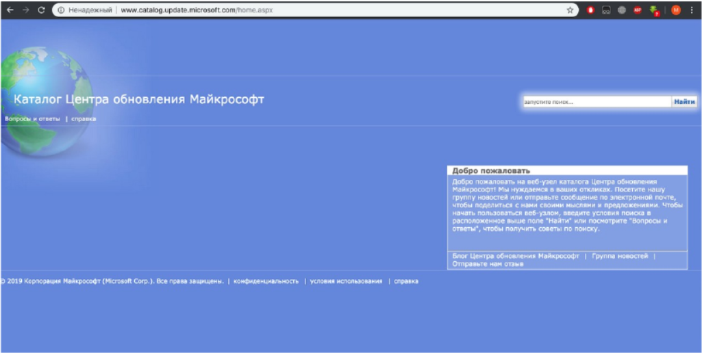

    И заполните следующую табличку в отчете:

| Номер обновления | Классификация | Версия | Размер |
|------------------|---------------|--------|--------|
| KB5021234 | Обновление безопасности   | Windows 10 22H2   | 680 МБ   |
| KB5012345 | Критическое обновление   | Windows 10 21H2   | 45 МБ   |

8.  **Настройте центр обновления как службу**

    1.  Перейдите в панель управления -> Администрирование -> Управление компьютером-> Службы и приложения-> Службы

    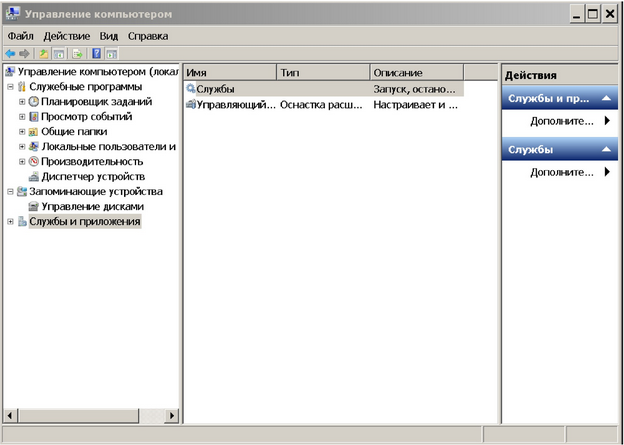

    2.  Запустите оснастку «Службы» и найдите службу «Центр обновления» и перейдите в Свойства данной службы

    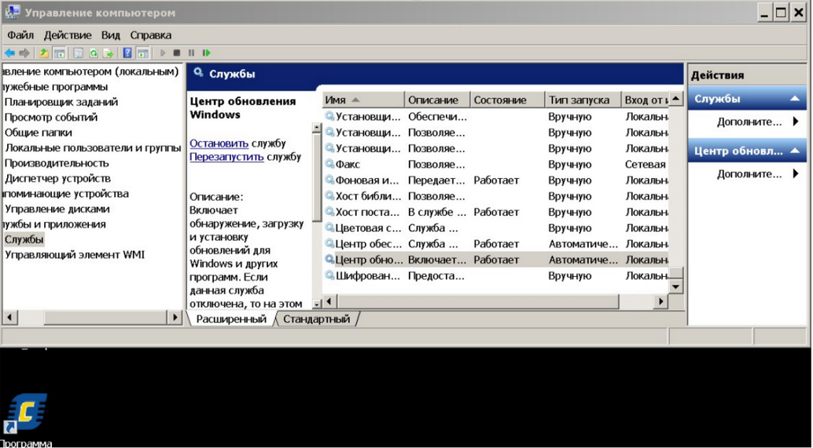

    3.  На вкладке Общие установите тип запуска: «Вручную»

    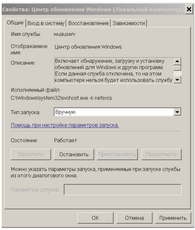

    На вкладке Восстановление установите параметры согласно скриншоту

    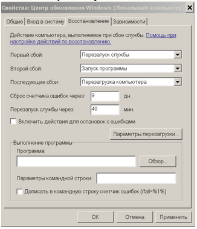

    Установите параметры перезагрузки ПК

    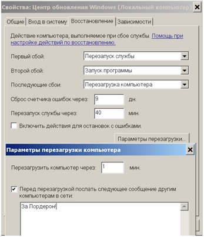

    Сохраните параметры настройки службы

**Контрольные вопросы:**

**1. Что такое обновление?**

Обновление — это набор файлов, выпускаемый Microsoft для операционной системы Windows, который исправляет ошибки, устраняет уязвимости системы безопасности, улучшает производительность, добавляет новые функции или обновляет драйверы устройств.

**2. Типы обновления Windows.**

Обновления Windows делятся на следующие типы:

- **Важные обновления** — обеспечивают защиту, безопасность и надежность компьютера. Устанавливаются автоматически.
- **Рекомендуемые обновления** — касаются некритических проблем, улучшают работу компьютера. Могут устанавливаться автоматически.
- **Необязательные обновления** — содержат драйверы и дополнительные программы, устанавливаются вручную.
- **Обновления безопасности** — исправляют уязвимости в системе безопасности.
- **Критические обновления** — устраняют ошибки, не связанные с безопасностью.
- **Пакеты обновлений (Service Packs)** — сборные наборы всех предыдущих исправлений и обновлений.

**3. Центр обновления Windows.**

Центр обновления Windows (Windows Update) — это встроенный компонент ОС Windows, который позволяет автоматически или вручную загружать и устанавливать обновления для операционной системы, драйверов и других продуктов Microsoft. Он предоставляет возможность проверять наличие обновлений, просматривать историю установок, настраивать автоматическую установку или отключать обновления.