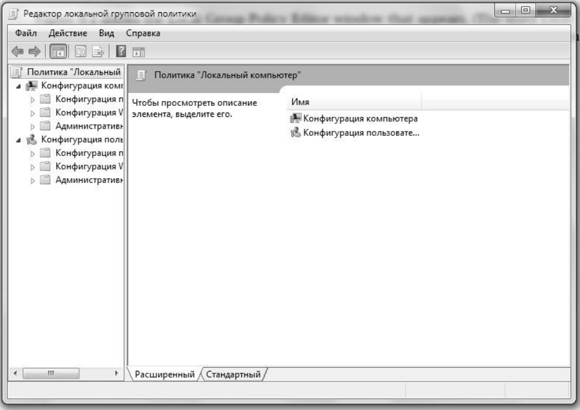
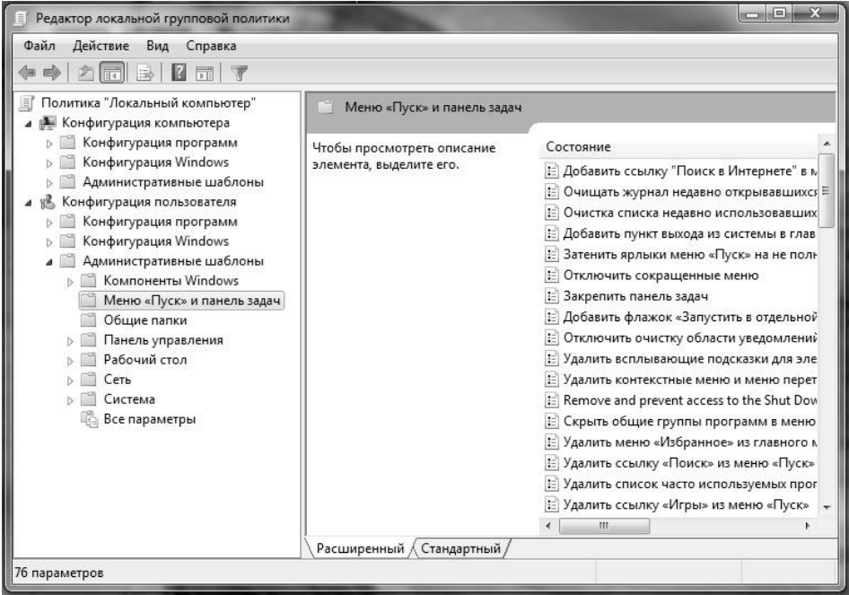
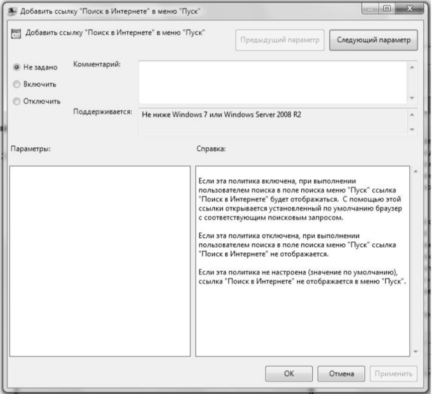
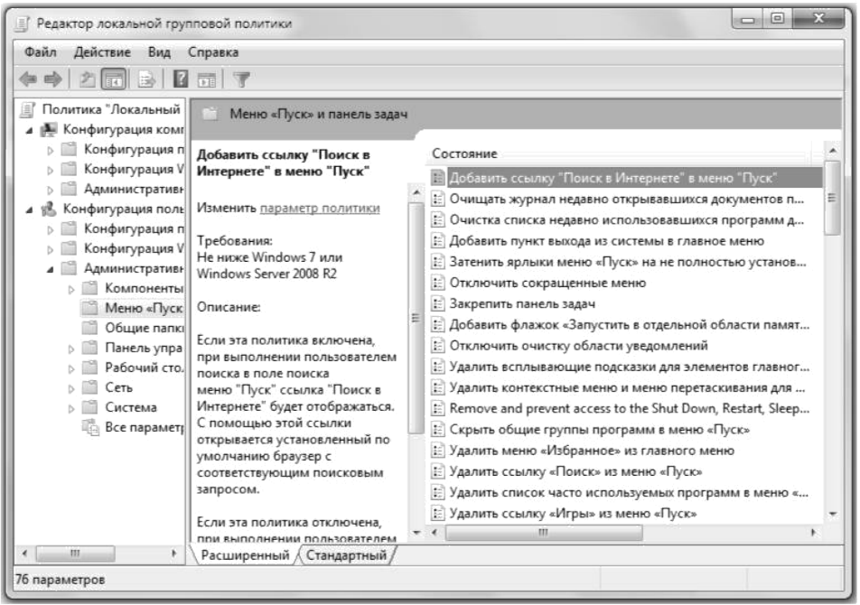
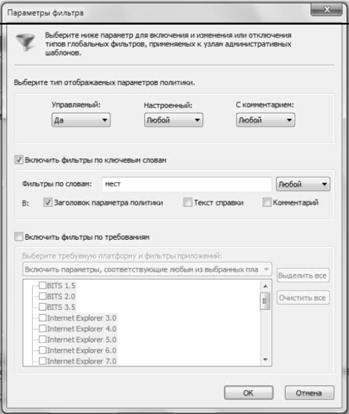
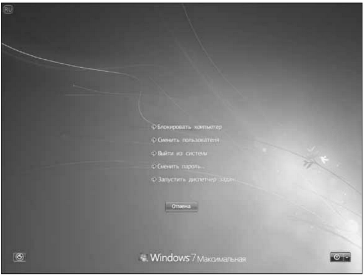
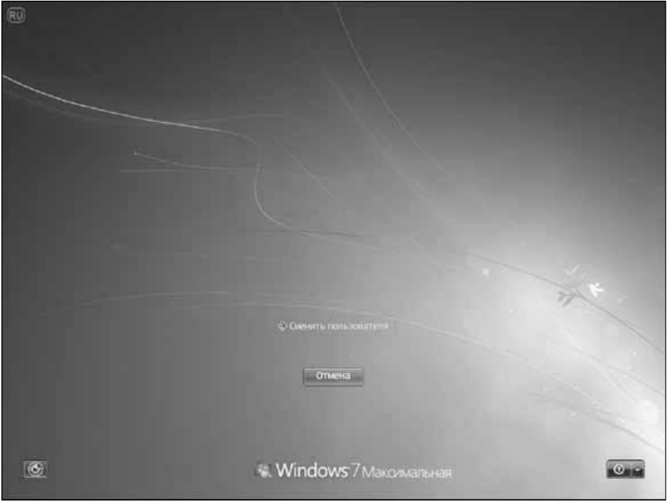
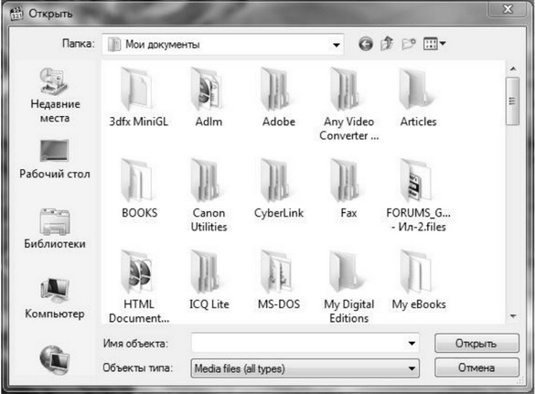
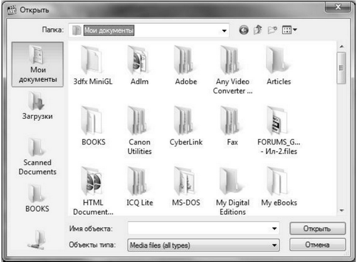
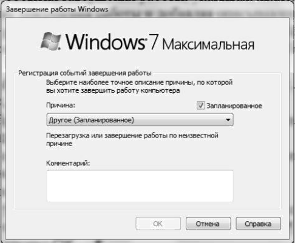

# Практическая работа №16

## Групповые политики Windows 10

**Теоретическая часть:**

1.  **Запуск редактора локальной групповой политики**

    Чтобы запустить редактор локальной групповой политики, выполните следующие действия.

    1.  Щелкните на кнопке Пуск.
    2.  Введите **gpedit.msc**.
    3.  Нажмите клавишу <Enter>.

    Открывающееся при этом окно Редактор локальной групповой политики показано на рис. 9.1. (Слово *локальных* отражает тот факт, что выполняется редактирование групповых политик на вашем собственном, а не на удаленном, компьютере.)

    

    ***Рис. 9.1.** Редактор локальной групповой политики предназначен для изменения групповых политик на локальном ПК*

2.  **Работа с групповыми политиками**

    Окно Редактор локальной групповой политики разделено на две части.

    - **Левая панель**. Эта панель содержит древовидную иерархическую структуру категорий политик, разделенных две основные категории: Конфигурация компьютера и Конфигурация пользователя. Политики конфигурации компьютера применяются ко всем пользователям и выполняются перед входом в систему. Политики конфигурации пользователя применяются только к текущему пользователю и, следовательно, не применяются до тех пор, пока пользователь не войдет в систему.
    - **Правая панель**. Эта панель содержит политики той категории, которая выбрана в левой панели.

    Таким образом, основная идея данного подхода состоит в открытии ветвей дерева для отыскания нужной категории. При щелчке на категории ее политики отображаются в правой панели. Например, на рис. 9.2 окно Редактор локальной групповой политики показано с выделенной категорией Конфигурация пользователя, Административные шаблоны, Меню "Пуск" и панель задач.

    

    ***Рис. 9.2.** При выборе категории в левой панели политики этой категории отображаются в правой панели*

    Столбец Параметр отображает имя политики, а столбец Состояние --- текущее состояние данной политики. Щелкните на политике, чтобы увидеть ее описание в левой части панели, как показано на рис. 9.3. Если описание не отображается, щелкните на вкладке Расширенный.

3.  **Настройка политики**

    Чтобы настроить политику, дважды щелкните на ней. Тип отображаемого при этом окна зависит от политики.

    

    Для простых политик отображается окно, подобное показанному на рис. 9.4. Эти виды политик принимают одно из трех состояний: Не задано (политика не действует), Включить (политика действует и ее настройки активизированы) и Отключить (политика действует, но ее параметры отключены).

    

    - Другие политики требуют отображения дополнительной информации, когда данная политика включена. Например, на рис. 9.5 показано окно для политики Элементы, отображаемые в панели мест (она подробно описана далее в разделе "Настройка панели мест" этой главы). Когда опция Включить активизирована, различные текстовые поля активизируются, и их можно использовать для ввода путей к папкам, которые требуется отображать в панели мест.

    

    ***Рис. 9.5.** Более сложные политики требуют также дополнительной информации, такой как список папок, которые должны отображаться в панели мест*

4.  **Фильтрация политик**

    В течение многих лет автор утверждал, что редактор локальной групповой политики отчаянно нуждается в функции поиска. Существует около 3000 политик, и они разбросаны по десяткам папок. Попытка найти нужную политику путем блуждания по ветвям редактора локальной групповой политики подобна попытке поиска иголки в стогу сена. Редактор локальной групповой политики в Windows Vista оснащен рудиментарной функцией поиска, но в целом ее можно определить словом *бесполезная*.

    К счастью, хотя редактор локальной групповой политики версии Windows 7 все еще не пригоден для поиска (если только не экспортировать его в текстовый файл, выбрав команду меню Действие Экспортировать список), он оснащен двумя новыми функциями, которые несколько упрощают нахождение затерявшейся политики.

    - Две ветви Административные шаблоны (одна в категории Конфигурация компьютера, вторая --- в категории Конфигурация пользователя), каждая из которых содержит ответвление Все параметры. Выбор этой ветви ведет к отображению полного списка всех политик в данной ветви Административные шаблоны. (Почти все политики, не связанные с безопасностью, располагаются в ветвях категории Административные шаблоны, почему и выделены для специальной обработки.)
    - Улучшенная функция фильтрации, которая действительно полезна для усечения безбрежного ландшафта доступных политик до приемлемого размера.

    В сочетании друг с другом эти две функции значительно упрощают поиск нужных элементов. Основная идея этого подхода состоит в выборе необходимой ветви Все параметры, а затем настройки фильтра, определяющего искомый элемент. После этого редактор локальной групповой политики отобразит только те политики, которые соответствуют критерию фильтрации.

    Чтобы продемонстрировать этот подход в действии, рассмотрим пример. Предположим, что требуется найти политику Элементы, отображаемые в панели мест, показанную на рис. 9.5. Фильтр для ее поиска можно было бы использовать следующим образом.

    1.  Выберите ветвь Конфигурация пользователя Административные шаблоны Все параметры.
    2.  Выберите в меню Действия Параметры фильтра, чтобы открыть диалоговое окно Параметры фильтра.
    3.  Удостоверьтесь, что флажок Включить фильтры по ключевым словам отмечен.
    4.  Воспользуйтесь текстовым полем Фильтры по словам, чтобы ввести слово или словосочетание, соответствующее искомой политике. В рассматриваемом примере известно, что слово "мест" --- часть имени политики, поэтому мы используем его в качестве текста фильтра.
    5.  Воспользуйтесь раскрывающимся списком, связанным с этим полем, чтобы выбрать уровень соответствия текста политики и критерия поиска.
        - **Любой** --- установите эту опцию, чтобы выбрать только те политики, которые содержат, по меньшей мере, один из терминов поиска;
        - **Все** --- установите эту опцию, чтобы выбрать только те политики, которые содержат все поисковые термины в любом порядке;
        - **Точный** --- установите эту опцию, чтобы выбрать только те политики, которые содержат текст, в точности совпадающий с поисковым словосочетанием.
    6.  Используйте флажки, чтобы указать, где фильтр должен искать соответствия.
        - **Заголовок параметра политики** --- установите этот флажок, чтобы выполнить поиск соответствий в именах политик; в данном примере "мест" --- часть имени политики и сравнительно уникальный термин, поэтому должно быть достаточно выполнить фильтрацию только по заголовку, как показано на рис. 9.6;
        - **Текст справки** --- установите этот флажок, чтобы выполнить поиск соответствий в описаниях политик;
        - **Комментарий** --- установите этот флажок, чтобы выполнить поиск соответствий в тексте комментариев. (Каждая политика имеет поле Комментарий, которое можно использовать, чтобы вставить "свои пять копеек" по поводу любой политики.)
    7.  Щелкните на кнопке OK.

    

    ***Рис. 9.6.** В окне редактора локальной групповой политики Windows 7 диалоговое окно Параметры фильтра можно использовать для поиска нужной политики*

    После того как фильтр определен, выберите команду меню Действие Фильтр (или активизируйте кнопку Фильтр в панели инструментов). Редактор локальной групповой политики отобразит только те политики, которые соответствуют установленным параметрам фильтра.

**Задание:**

**Примеры групповых политик**

Хотя эта книга содержит множество примеров групповых политик, вы пока не в состоянии использовать этот мощный инструмент максимально эффективно. Поэтому остальные разделы этой главы посвящены ряду любимых политик автора.

**Настройка окна безопасности Windows**

При нажатии сочетания клавиш <Ctrl+Alt+Delete> во время сеанса Windows 7 открывается окно безопасности Windows, содержащее следующие кнопки (рис. 9.8).

- **Блокировать компьютер**. Щелкните на этой кнопке, чтобы скрыть рабочий стол и отобразить окно Заблокировано. Чтобы вернуться к рабочему столу, нужно ввести пароль своей учетной записи пользователя Windows 7. Эта функциональная возможность полезна, когда требуется на некоторое время оставить компьютер без присмотра, предотвратив при этом доступ посторонних к рабочему столу. Однако Windows 7 предлагает более быстрый способ блокирования компьютера: для этого достаточно нажать сочетание <клавиша с логотипом Windows+L>.
- **Сменить пользователя**. Щелкните на этой кнопке, чтобы открыть сеанс учетной записи другого пользователя, не закрывая сеанс текущей учетной записи пользователя.
- **Выйти из системы**. Щелкните на этой кнопке, чтобы открыть экран приветствия, который позволяет войти в систему, используя другую учетную запись пользователя.
- **Сменить пароль**. Щелкните на этой кнопке, чтобы открыть окно Смена пароля, которое позволяет указать новый пароль для своей учетной записи.
- **Запустить диспетчер задач**. Щелкните на этой кнопке, чтобы открыть Диспетчер задач.

***Рис. 9.8.** Чтобы в среде Windows 7 отобразить диалоговое окно безопасности, нажмите сочетание клавиш <Ctrl+Alt+Delete>*

Все эти команды, за исключением Сменить пользователя, можно настраивать посредством групповых политик. Поэтому если окажется, что одна или более из этих команд никогда не используется, или (что более вероятно) если нужно воспрепятствовать доступу пользователя к одной и более команд, групповые политики можно применять для удаления команд из окна безопасности Windows. Для этого понадобится выполнить следующие действия.

1.  Откройте окно Редактор локальной групповой политики, как описано ранее.
2.  Последовательно разверните ветви Конфигурация пользователя, Административные шаблоны, Система, Варианты действий после нажатия CTRL+ALT+DEL.
3.  Дважды щелкните на одной из следующих политик.
    - **Запретить изменение пароля** --- эту политику можно использовать для отключения кнопки Сменить пароль в окне безопасности Windows;
    - **Запретить блокировку компьютера** --- эту политику можно использовать для отключения кнопки Блокировать компьютер в окне безопасности Windows;
    - **Удалить диспетчер задач** --- эту политику можно использовать для отключения кнопки Запустить диспетчер задач в окне безопасности Windows;
    - **Запретить завершение сеанса** --- эту политику можно использовать для отключения кнопки Выйти из системы в окне безопасности Windows.
4.  В открывшемся диалоговом окне политики щелкните на переключателе Включить, а затем на кнопке OK.
5.  Повторите шаги 3 и 4, чтобы отключить все кнопки, которые не нужны.

Окно безопасности Windows с четырьмя удаленными кнопками показано на рис. 9.9.

***Рис. 9.9.** Групповые политики можно использовать для удаления большинства кнопок окна безопасности Windows*

Чтобы проделать эту же настройку с помощью реестра (см. главу 12), запустите Редактор реестра и откройте следующий ключ:

> HKCU\Software\Microsoft\Windows\CurrentVersion\Policies\System

Измените значение одного или более из следующих параметров на **0**:

> DisableChangePassword
>
> DisableLockWorkstation
>
> DisableTaskMgr

Чтобы посредством реестра удалить кнопку Выйти из системы, откройте следующий ключ:

> HKCU\Software\Microsoft\Windows\CurrentVersion\Policies\Explorer

Измените значение параметра NoLogoff на **1**.

**Настройка панели мест**

Левая часть диалоговых окон Сохранить как и Открыть, отображаемых в приложениях Windows 7 в старом стиле, содержит несколько ссылок на обычно используемые места: Недавние места, Рабочий стол, Библиотеки, Компьютер и Сеть, как показано на рис. 9.10.

> Примечание
>
> Если при открытии диалогового окна Сохранить как или Открыть в левой части вместо простых ссылок отображается навигационная панель, это означает, что приложение использует обновленные диалоговые окна. Однако раздел Избранное все же можно настраивать: чтобы добавить папку, перетащите ее из списка папок в список Избранное; чтобы удалить пользовательскую ссылку из списка Избранное, щелкните на ней правой кнопкой мыши, в контекстном меню выберите команду Удалить, а затем, когда Windows запросит подтверждение, щелкните на кнопке Да.

***Рис. 9.10.** В левой части диалоговых окон Сохранить как и Открыть, отображаемых в старом стиле, находятся значки обычно используемых мест*

Область, содержащая эти значки, называется панелью мест. При наличии двух или более папок, которые используются регулярно (например, в системе может существовать несколько папок для различных находящихся в стадии разработки проектов), переключение между ними может быть обременительным процессом. Для упрощения этой задачи панель мест можно настроить, включая в нее значки для каждой из таких папок. В результате, независимо от того, какие места отображаются в диалоговом окне Сохранить как или Открыть, переход к одной из регулярно используемых папок можно будет осуществлять одним щелчком мыши.

Простейший способ достижения этой цели --- применение редактора локальной групповой политики, как показано в следующем примере.

1.  Откройте окно Редактор локальной групповой политики, как было описано ранее в этой главе.
2.  Откройте узел Конфигурация пользователя Административные шаблоны Компоненты Windows Проводник Windows Общее диалоговое окно открытия файлов.
3.  Дважды щелкните на политике Элементы, отображаемые в панели мест.
4.  Щелкните на переключателе Включить.
5.  Используйте текстовые поля Элемент 1 --- Элемент 5 для ввода путей к папкам, которые требуется отображать в панели мест. Ими могут быть локальные или сетевые папки, как было показано ранее на рис. 9.5.
6.  Щелкните на кнопке OK, чтобы ввести политику в действие. Диалоговое окно, отображающее в панели мест значки папок, которые были определены на рис. 9.5, показано на рис. 9.11.

При отсутствии доступа к редактору локальной групповой политики для выполнения этой же настройки можно использовать редактор реестра. Откройте редактор реестра и перейдите к следующему ключу:

> HKCU\Software\Microsoft\Windows\CurrentVersion\Policies\

***Рис. 9.11.** Диалоговое окно с пользовательской панелью мест*

Выполните перечисленные ниже действия.

1.  Выберите команду меню Правка Создать Раздел, введите comdlg32 и нажмите клавишу <Enter>.
2.  Выберите команду меню Правка Создать Раздел, введите Placesbar и нажмите клавишу <Enter>.
3.  Выберите команду меню Правка Создать Строковый параметр, введите Place0 и нажмите клавишу <Enter>.
4.  Нажмите клавишу <Enter>, чтобы открыть новый параметр, введите путь к папке, а затем щелкните на кнопке OK.
5.  Повторите шаги 3 и 4, чтобы добавить другие места (под названиями Place1--Place4).

> Примечание
>
> Если вы вообще не используете панель мест, ее можно скрыть и освободить место в отображаемых в старом стиле диалоговых окнах Открыть и Сохранить как. Для этого откройте редактор локальной групповой политики и перейдите к ветви Конфигурация пользователя Административные шаблоны Компоненты Windows Проводник Windows Общее диалоговое окно открытия файлов. Дважды щелкните на политике Скрыть панель адресов из общих диалогов открытия файлов, а затем щелкните на кнопке OK.

**Увеличение размера списка недавних документов**

В главе 5 было показано, как в Windows 7 настроить меню Пуск, чтобы включить в него пункт Недавние документы. Щелчок на этом пункте меню отображает список последних 15 документов, с которыми недавно выполнялась работа. Если окажется, что часто требуемый документ не отображается в этом списке, несмотря на то, что он использовался недавно, вероятно, отображения 15 документов недостаточно. В этом случае групповую политику можно использовать для настройки Windows 7 так, чтобы меню Пуск отображало больше недавних документов.

Чтобы узнать, как добавить пункт Недавние документы в меню Пуск, обратитесь к главе 5. Для изменения размера списка Недавние документы выполните перечисленные ниже действия.

1.  Откройте окно Редактор локальной групповой политики, как описано ранее в этой главе.
2.  Перейдите к ветви Конфигурация пользователя Административные шаблоны Компоненты Windows Проводник Windows.
3.  Дважды щелкните на политике Максимальная длина списка "Недавние документы".
4.  Щелкните на переключателе Включить.
5.  Используйте счетчик Максимальная длина списка "Недавние документы", чтобы указать количество документов, которые должны отображаться в меню Windows 7.
6.  Щелкните на кнопке OK.

> Примечание
>
> В счетчике Максимальная длина списка "Недавние документы" можно указывать значение от 1 до 9999. Если указано больше документов, чем помещается на экране по вертикали, Windows 7 добавляет к верхней и нижней части списка Недавние документы кнопки прокрутки.

**Включение диалога слежения за завершением работы**

При выборе команды меню Пуск Завершение работы Windows 7 запускает процесс завершения работы без дополнительных действий пользователя (если только какие-то выполняющиеся программы не содержат документы с несохраненными изменениями). Обычно это удобно, но иногда может потребоваться отслеживать причины остановки или перезапуска Windows 7 пользователем или же самой системой. Для этого можно включить функцию, получившую название Диалога слежения за завершением работы. Эта функция позволяет документировать события завершения работы, указывая, является ли оно запланированным или незапланированным, выбирая причину завершения работы и добавляя описывающие его комментарии.

Чтобы посредством групповой политики включить отображение диалога слежения за завершением работы, выполните следующие действия.

1.  Откройте окно Редактор локальной групповой политики, как описано ранее в этой главе.
2.  Перейдите к ветви Конфигурация компьютера Административные шаблоны Система.
3.  Дважды щелкните на политике Отображать диалог слежения за завершением работы.
4.  Щелкните на переключателе Включить.
5.  В списке Диалог слежения за завершением работы должен отображаться выберите опцию Всегда.
6.  Щелкните на кнопке OK.

Теперь при выборе команды меню Пуск Завершение работы будет отображаться диалоговое окно Завершение работы Windows, показанное на рис. 9.12. Это окно предоставляет три новых элемента управления.

- **Запланированное**. Оставьте этот флажок установленным, если данное завершение работы является запланированным. Если вы не планировали завершить работу Windows 7 (например, перезапуск вызван сбоем программы или нестабильной работой системы), снимите отметку с этого флажка.
- **Причина**. Этот список служит для выбора причины завершения работы. (Обратите внимание, что элементы, отображаемые в этом списке, зависят от состояния флажка Запланированное.)
- **Комментарий**. Используйте это текстовое поле для описания события завершения работы. При выборе опции Другое (Запланированное) либо Другое (Незапланированное), чтобы активизировать кнопку OK, придется добавить комментарий; для всех остальных опций списка Причина текст комментария не обязателен.

***Рис. 9.12.** Диалоговое окно Завершение работы Windows открывается, когда функция Диалог слежения за завершением работы включена*

Чтобы активизировать диалог слежения за завершением работы в системах, не имеющих редактора локальной групповой политики, откройте редактор реестра и перейдите к следующему ключу:

> HKLM\Software\Policies\Microsoft\Windows NT\Reliability

Измените значение следующих двух параметров на **1**:

> ShutdownReasonOn
>
> ShutdownReasonUI

**Контрольные вопросы:**

**1. Что такое групповые политики?**

Групповые политики — это набор правил и настроек операционной системы Windows, которые позволяют администраторам управлять параметрами рабочей среды пользователей и компьютеров. С их помощью можно ограничивать или разрешать доступ к различным функциям системы, настраивать интерфейс, параметры безопасности, устанавливать программное обеспечение и многое другое.

**2. Категории объектов групповых политик**

Редактор локальной групповой политики содержит две основные категории:

- **Конфигурация компьютера** — политики, которые применяются ко всем пользователям данного компьютера и выполняются перед входом пользователя в систему. Обычно используются для настройки параметров ОС на уровне всего компьютера.
- **Конфигурация пользователя** — политики, которые применяются только к конкретному пользователю после его входа в систему. Позволяют настраивать персональную рабочую среду.

**3. Разделы групповых политик**

Основные разделы (ветви) групповых политик включают:

- **Административные шаблоны** — содержат большинство параметров реестра, управляющих поведением ОС, приложений и компонентов Windows.
- **Параметры безопасности** — настройки, связанные с паролями, правами доступа, аудитом и другими аспектами безопасности.
- **Настройка программ** — управление установкой и удалением приложений.
- **Сценарии (вход/выход из системы, запуск/завершение работы)** — автоматическое выполнение скриптов при определенных событиях.

**4. Запуск групповых политик**

Для запуска редактора локальной групповой политики необходимо выполнить следующие действия:

1. Нажать кнопку «Пуск».
2. Ввести в строке поиска команду `gpedit.msc`.
3. Нажать клавишу `<Enter>`. Откроется окно «Редактор локальной групповой политики».
