# Лабораторная работа №17

## Перенос данных из Windows 7 в Windows 10

> В этой лабораторной работе вы будете использовать Windows 7 и Windows 10 на виртуальной машине.

> **Рекомендуемое оборудование**
>
> Для этого упражнения требуется следующее оборудование:
> - Компьютер, работающий под управлением Windows 7 Professional и Windows 10 Pro.

---

### 1. [(WINDOWS 7)]{.mark}

Откройте сеанс на компьютере и создайте папку с именем «Для переноса» (For transferring).

Затем в Блокноте создайте файл с текстом «Со старого ПК» и сохраните его в папке "For Transfering" (Для переноса). Присвойте файлу имя "Data" (Данные).

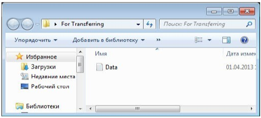

Создайте на Рабочем столе папку с именем "Перенос" (Файлы данных для переноса).

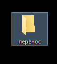

---

### 2. Выберите Пуск > Все программы > Стандартные > Служебные > Средство переноса данных Windows.

Откроется окно «Перенос файлов и данных Windows».

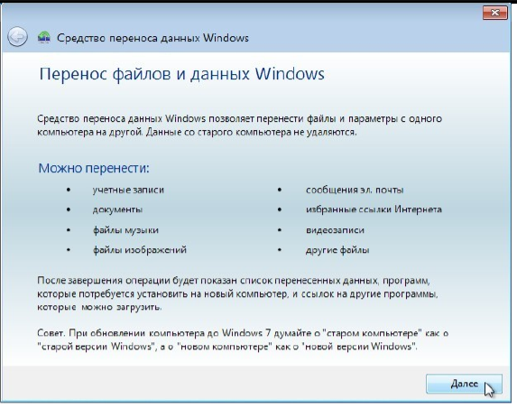

Нажмите кнопку **Далее**.

Откроется окно «Выберите способ переноса файлов и параметров на новый компьютер».

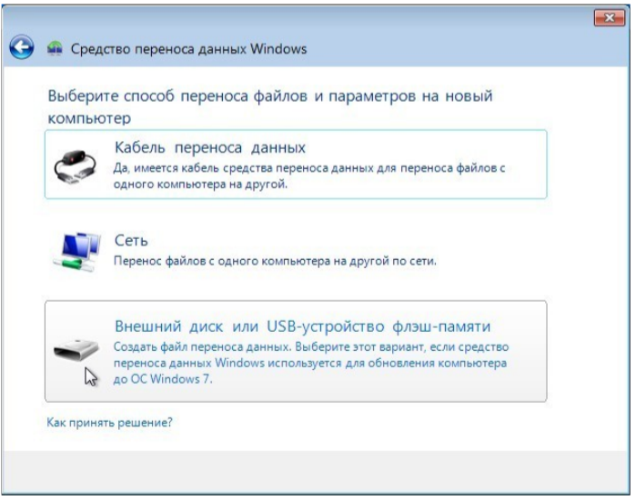

Выберите **Внешний диск или USB-устройство флэш-памяти**.

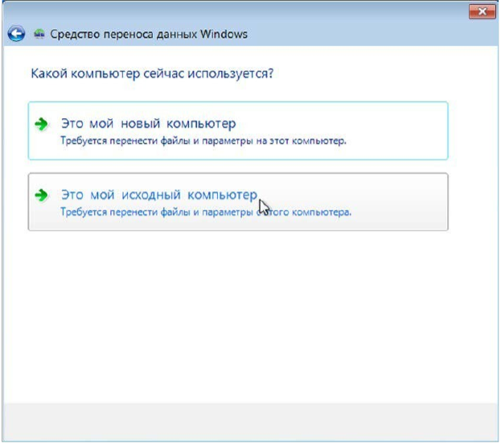

Откроется окно «Какой компьютер сейчас используется?».

Выберите **Это мой исходный компьютер**. Появится окно «Проверка возможности переноса...».

Появится окно «Выберите данные, переносимые с этого компьютера».

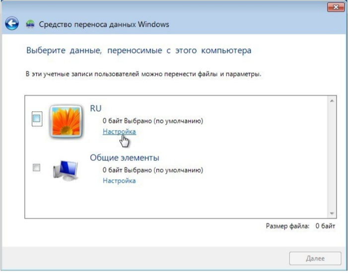

Снимите флажки со всех учётных записей и щёлкните **Настройка** для той учётной записи, под которой вы работаете.

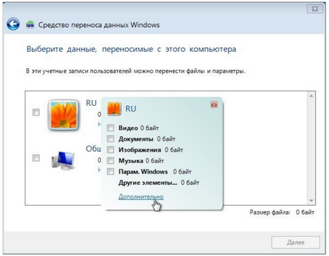

Когда откроется окно настройки для вашей учётной записи, щёлкните **Дополнительно**.

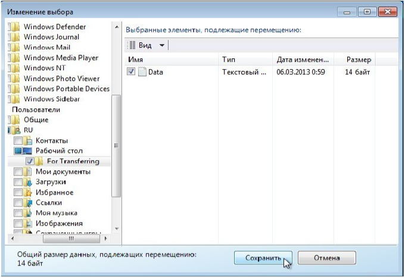

Найдите папку "For Transferring" (Для переноса). Отсюда будут переноситься файлы.

Выберите файл **Data** (Данные) и нажмите кнопку **Сохранить**. Появится окно «Выберите данные, переносимые с этого компьютера».

**Каков размер файла, который вы будете переносить?**

Нажмите кнопку **Далее**.

Появится окно «Сохранение файлов и параметров для переноса».

Так как вы просто переносите файлы обратно на тот же самый компьютер, вводить пароль не требуется.

Нажмите кнопку **Сохранить**.

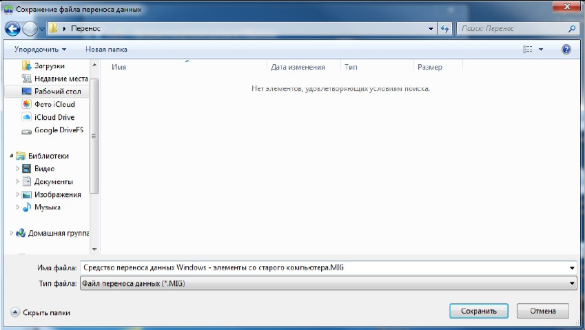

На Рабочем столе найдите ранее созданную папку "Перенос" (Файлы данных для переноса) и нажмите кнопку **Сохранить**.

Появится окно «Данные файлы и параметры сохранены для переноса».

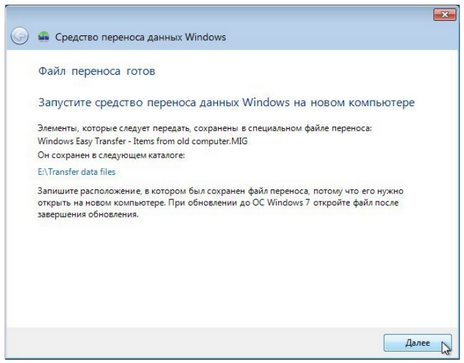

Нажмите кнопку **Далее**.

Появится окно «Файл переноса готов».

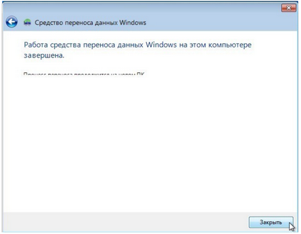

Нажмите кнопку **Далее**.

Появится окно «Работа средства переноса данных Windows на этом компьютере завершена».

Нажмите кнопку **Закрыть**.

---

### 3. Запустите Виртуальную машину под управлением ОС Windows 10. Прежде чем выполнять какие либо действия, необходимо установить утилиты виртуальной машины. Для этого следуйте скриншотам.


Устанавливаем и перезагружаемся. Думаю поставить сами сможете))).

---

### 4. Копируем папку Перенос из ОС Windows 7 в Windows 10

 !( )

---

### 5. В Windows 10 нет средства переноса как в Windows 7. Поэтому, из папки отчеты скопировать папку migwiz на Windows 10


Копируем папку migwiz и переносим ее в Windows 10 на рабочий стол.


Открываем папку и запускаем


 !( ) !( ) !( ) !( ) !( )


Процесс переноса данных завершен.

---

## Контрольные вопросы

1. Все ли файлы были успешно перенесены?

2. Какие способы миграции (переноса) данных вы можете назвать?
```