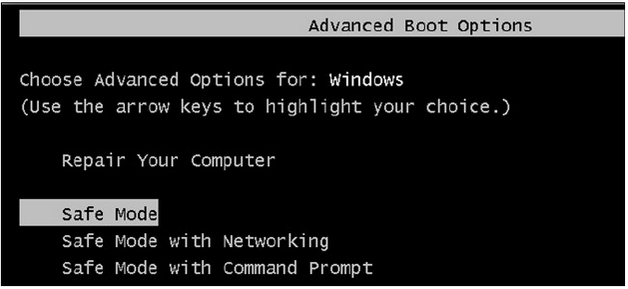
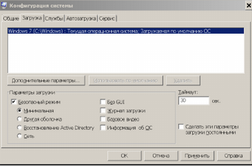
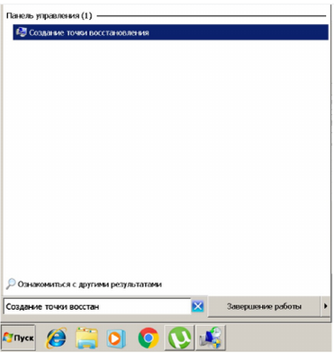
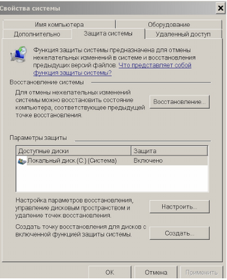
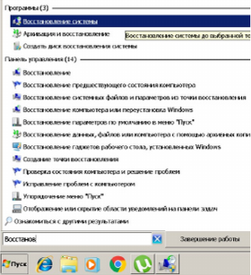
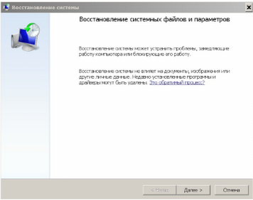
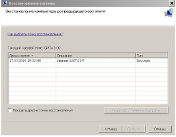
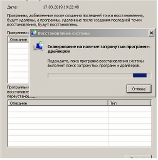
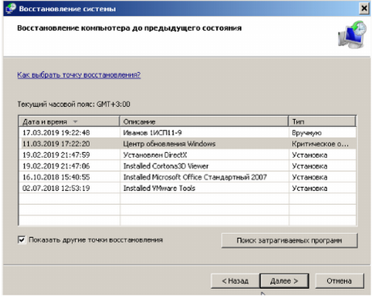
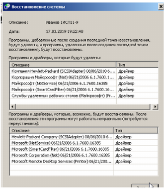

# Лабораторная работа №18

## Восстановление работы системы через безопасный режим

**Цель:** Изучить принцип восстановления работы ОС Windows в безопасном режиме

**Теоретические сведения:**

**Безопасный режим** - это способ загрузки операционной системы, при котором загружаются самые минимальные компоненты. Даже фоновой картинки на Рабочем столе не будет.

*Безопасный режим* хорош тем, что не дает загружаться приложениям, прописанным в автозагрузке. Поэтому его наиболее часто используют когда компьютер заражен вирусами. Вот небольшой перечень того, что можно делать в безопасном режиме:

- Проверка операционной системы на вирусы. В этом режиме не загружается то, что находится в автозагрузке. А именно там любят прописываться вирусы. Поэтому в нём можно загрузиться и проверить компьютер на вирусы, которые в обычном режиме блокируют и не дают это сделать антивирусам. Так же в нём можно установить их и проверить.
- Восстановить компьютер. В Windows есть *Средство восстановления системы*, которое лучше запустить именно в этом режиме в том случае, когда компьютер стал нестабильно работать.
- Установить и обновить драйвера. В безопасном режиме драйвера загружаются самые минимальные. И если компьютер работают с глюками и проблема кроется в них, то этот режим может помочь с этой проблемой.
- Проверить работу компьютера. Бывает такое, что в нормальном режиме комп тупит, а в безопасном всё хорошо. Тогда дело в программной части и нужно разбираться с ПО. Если же в безопасном режиме проблемы те же, то, скорее всего, дело в аппаратной части.

**Задание на лабораторную работу:**

1.  На виртуальной машине загрузитесь в Windows 7 в обычном режиме.

2.  Запустите конфигурацию системы msconfig и на вкладке загрузка установите в качестве параметра загрузки Безопасный режим.

    

3.  Нажмите Применить и ОК. На вопрос системы выберите «Выход без перезагрузки».

    

4.  Зайдите в меню создания точки восстановления системы. Для этого откройте меню ПУСК и в строке поиска начните набирать «Создание точки».

    

5.  Откроется меню «Свойства системы», на вкладке Защита системы -> Параметры защиты нажмите Создать

    

6.  Создайте точку восстановления системы. Введите в названии точки восстановления системы Вашу фамилию и номер группы. К примеру как это показано на скриншоте:

    ![alt text]./18labPIck/(изображение-5.png)

    Нажмите Создать и дождитесь окончания Создания точки восстановления системы

    

7.  Проверьте успешность созданной Вами точки Восстановления системы. Для этого зайдите в меню восстановление системы. Откройте меню ПУСК и в строке поиска начните набирать «Восстановление»

    

8.  Откроется средство «Восстановление системы»

    

9.  Нажмите Далее. Откроются созданные Вами точки восстановления системы. Убедитесь в том что Ваша точка восстановления системы присутствует. И нажмите Отмена.

    

10. Перезагрузите Windows 7 на виртуальной машине. Загрузка в безопасный режим будет осуществляться автоматически.

11. В безопасном режиме Windows 7 откройте меню «Восстановления системы» (см. Пункт 7).

12. В списке точек восстановления системы установите галочку «Показать другие точки восстановления». Сколько точек восстановления было создано системой автоматически?

13. Выберите вашу точку восстановления системы и нажмите «Поиск затрагиваемых программ»

    

14. Просмотрите список затрагиваемых программ. Какие программы будут удалены после применения точки восстановления системы? 

    

15. Закройте список затрагиваемых программ и просмотрите тот же список, но для самой старой точки восстановления. Какие отличия в затрагиваемых программах имеются по сравнению с новой точкой восстановления? 

16. Вернитесь к списку точек восстановления, выберите точку созданную Вами и нажмите Далее, а затем Готово

17. На вопрос системы «Продолжить?» нажмите Да.

    

18. Начнется восстановление системы

    

19. После перезагрузки Вы заново попадете в Безопасный режим ОС.

    Успешное восстановление системы будет сопровождаться сообщением:

    

20. В msconfig на вкладке «Загрузка» в Параметрах Загрузки снимите галочку с безопасного режима и перезагрузите Windows 7 в нормальный режим работы.

**Контрольные вопросы:**

**1. Что такое безопасный режим Windows?**

Безопасный режим — это диагностический режим загрузки Windows, при котором запускаются только самые минимальные компоненты ОС (базовые драйверы и службы). Используется для устранения неполадок, вызванных вирусами, драйверами или некорректным ПО.

**2. Параметры запуска Безопасного режима.**

- **Минимальный** — базовый набор драйверов и служб.
- **С загрузкой сетевых драйверов** — добавляется поддержка сети.
- **С поддержкой командной строки** — вместо графического интерфейса загружается CMD.
- **С ведением журнала загрузки** — запись загружаемых драйверов в файл.
- **Низкое разрешение видео (VGA)** — загрузка со стандартным драйвером VGA.

**3. Отличия безопасного режима от чистой загрузки ОС**

| Безопасный режим | Чистая загрузка |
|------------------|------------------|
| Загружаются ТОЛЬКО минимальные системные драйверы и службы | Загружается ПОЛНАЯ Windows, но отключены сторонние службы и автозагрузка |
| Упрощенный интерфейс (низкое разрешение, нет тем) | Полноценный интерфейс |
| Используется при серьезных сбоях, когда ОС не загружается | Используется при нестабильной работе уже загруженной системы |
| На экране есть надпись «Безопасный режим» | Специальных надписей нет |
