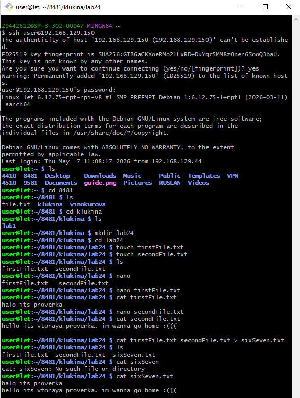
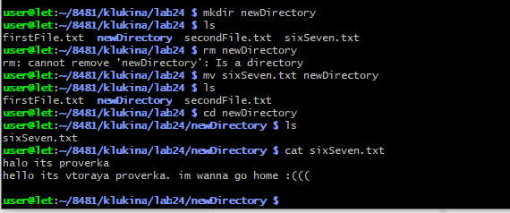
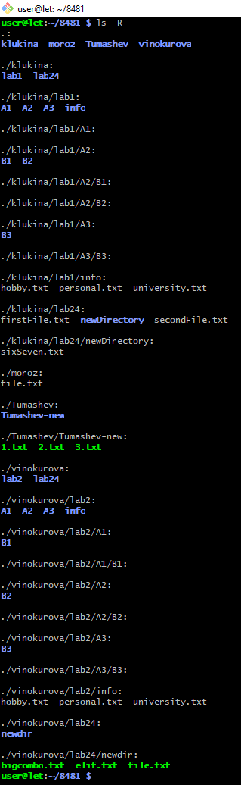
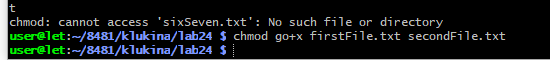
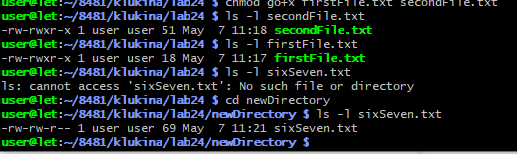
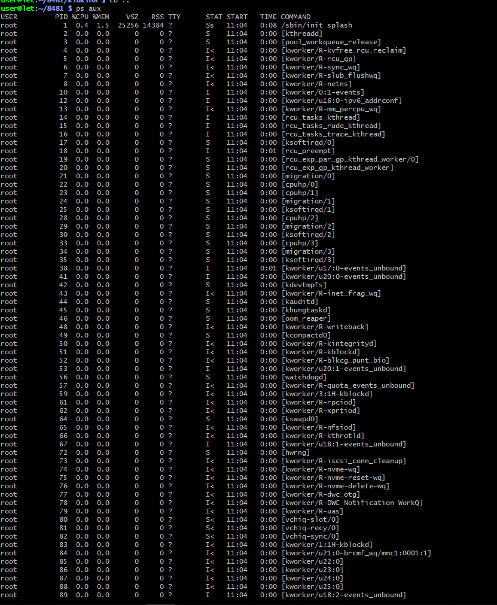

# Лабораторная работа №24

## ИЗУЧЕНИЕ ФАЙЛОВОЙ СИСТЕМЫ ОС LINUX И ФУНКЦИЙ ПО ОБРАБОТКЕ И УПРАВЛЕНИЮ ДАННЫМИ

**Цель работы:**

- Изучение команд, связанных с пользователями и группами;
- Изучение структуры файловой системы Linux, изучение общих команд создания, удаления, модификации файлов и каталогов, функций манипулирования данными, алиасами;
- Изучение иерархии процессов;
- Приобретение навыков по смене атрибутов объектов, смене прав доступа к объектам;
- Изучение организации безопасности системы, местонахождение файлов с паролями, просмотр системной информации и получение служебной информации.

**План проведения занятия:**

1. Ознакомиться с краткими теоретическими сведениями. Приобрести навыки работы в терминале Linux.
2. Научиться создавать новые файлы и каталоги, разобрать назначение прав доступа к файлам и папкам.
3. Приготовиться к сдаче лабораторной работы.

**Оборудование:**

*Аппаратная часть:* персональный компьютер, сетевой или локальный принтер.

*Программная часть:* операционная система Linux Ubuntu.

---

## Краткие теоретические сведения

### Файловая структура системы LINUX

В операционной системе LINUX файлами считаются обычные файлы, каталоги, а также специальные файлы, соответствующие периферийным устройствам (каждое устройство представляется в виде файла). Доступ ко всем файлам однотипный, в том числе, и к файлам периферийных устройств. Такой подход обеспечивает независимость программы пользователя от особенностей ввода/вывода на конкретное внешнее устройство.

Файловая структура LINUX имеет иерархическую древовидную структуру. В корневом каталоге размещаются другие каталоги и файлы, включая 5 основных каталогов:

**bin** — большинство выполняемых командных программ и *shell* — процедур;

**tmp** — временные файлы;

**usr** — каталоги пользователей (условное обозначение);

**etc** — преимущественно административные утилиты и файлы;

**dev** — специальные файлы, представляющие периферийные устройства; при добавлении периферийного устройства в каталог /dev должен быть добавлен соответствующий файл (черта / означает принадлежность корневому каталогу).

Текущий каталог — это каталог, в котором в данный момент находится пользователь. При наличии прав доступа, пользователь может перейти после входа в систему в другой каталог. Текущий каталог обозначается точкой (**.**); родительский каталог, которому принадлежит текущий, обозначается двумя точками (**..**).

Полное имя файла может включать имена каталогов, включая корневой, разделенных косой чертой, например: /home/student/file.txt. Первая косая черта обозначает корневой каталог, и поиск файла будет начинаться с него, а затем в каталоге home, затем в каталоге student.

Один файл можно сделать принадлежащим нескольким каталогам. Для этого используется команда **ln (link)**:

> **ln <имя файла 1> <имя файла 2>**

Имя 1-го файла — это полное составное имя файла, с которым устанавливается связь; имя 2-го файла — это полное имя файла в новом каталоге, где будет использоваться эта связь. Новое имя может не отличаться от старого. Каждый файл может иметь несколько связей, т.е. он может использоваться в разных каталогах под разными именами. Команда **ln** с аргументом -s создает символическую связь:

> **ln -s <имя файла 1> <имя файла 2>**

Здесь имя 2-го файла является именем символической связи. Символическая связь является особым видом файла, в котором хранится имя файла, на который символическая связь ссылается. LINUX работает с символической связью не так, как с обычным файлом — например, при выводе на экран содержимого символической связи появятся данные файла, на который эта символическая связь ссылается.

### Права доступа

В LINUX различаются 3 уровня доступа к файлам и каталогам:

1. доступ владельца файла;
2. доступ группы пользователей, к которой принадлежит владелец файла;
3. остальные пользователи.

Для каждого уровня существуют свои байты атрибутов, значение которых расшифровывается следующим образом:

r — разрешение на чтение;
w — разрешение на запись;
x — разрешение на выполнение;
--- — отсутствие разрешения.

Первый символ байта атрибутов определяет тип файла и может интерпретироваться со следующими значениями:

--- — обычный файл;
d — каталог;
l — символическая связь;
b — блок-ориентированный специальный файл, который соответствует таким периферийным устройствам, как накопители на магнитных дисках;
c — байт-ориентированный специальный файл, который может соответствовать таким периферийным устройствам как принтер, терминал.

В домашнем каталоге пользователь имеет полный доступ к файлам (READ, WRITE, EXECUTE; r, w, x).

Атрибуты файла можно просмотреть командой **ls -l** и они представляются в следующем формате:

```
d              rwx              rwx              rwx
|              |                |                |
|              |                |                | Доступ для остальных пользователей
|              |                | Доступ к файлу для членов группы
|              | Доступ к файлу владельца
| Тип файла (директория)
```

**Пример.** Командой **ls -l** получим листинг содержимого текущей директории student:

```
--- rwx --- --- 2 student 100  Mar 10 10:30 file_1
--- rwx --- r--- 1 adm      200  May 20 11:15 file_2
--- rwx --- r--- 1 student  100  May 20 12:50 file_3
```

После байтов атрибутов на экран выводится следующая информация о файле:

- число связей файла;
- имя владельца файла;
- размер файла в байтах;
- дата создания файла (или модификации);
- время;
- имя файла.

### Изменение прав доступа

Атрибуты файла и доступ к нему можно изменить командой:

**chmod <коды защиты> <имя файла>**

Коды защиты могут быть заданы в числовом или символьном виде. Для символьного кода используются:

знак плюс (+) — добавить права доступа;
знак минус (-) — отменить права доступа;

r, w, x — доступ на чтение, запись, выполнение;
u, g, o — владельца, группы, остальных.

Коды защиты в числовом виде могут быть заданы в восьмеричной форме. Для контроля установленного доступа к своему файлу после каждого изменения кода защиты нужно проверять свои действия с помощью команды **ls -l**.

**Примеры:**

**chmod g+rw,o+r file.1** — установка атрибутов чтения и записи для группы и чтения для всех остальных пользователей;

**ls -l file.1** — чтение атрибутов файла;

**chmod o-w file.1** — отмена атрибута записи у остальных пользователей;

**>letter** — создание файла letter. Символ > используется как для переадресации, так и для создания файла;

**cat** — вывод содержимого файла;

**cat file.1 file.2 > file.12** — конкатенация файлов (объединение);

**mv file.1 file.2** — переименование файла file.1 в file.2;

**mv file.1 file.2 file.3 directory** — перемещение файлов file.1, file.2, file.3 в указанную директорию;

**rm file.1 file.2 file.3** — удаление файлов file.1, file.2, file.3;

**cp file.1 file.2** — копирование файла с переименованием;

**mkdir namedir** — создание каталога;

**rm dir_1 dir_2** — удаление каталогов dir_1 dir_2;

**ls [acdfgilqrstv CFR] namedir** — вывод содержимого каталога; если в качестве namedir указано имя файла, то выдается вся информация об этом файле.

**Значения аргументов ls:**
- l — список включает всю информацию о файлах;
- t — сортировка по времени модификации файлов;
- a — в список включаются все файлы, в том числе и те, которые начинаются с точки;
- s — размеры файлов указываются в блоках;
- d — вывести имя самого каталога, но не содержимое;
- r — сортировка строк вывода;
- i — указать идентификационный номер каждого файла;
- v — сортировка файлов по времени последнего доступа;
- q — непечатаемые символы заменить на знак ?;
- c — использовать время создания файла при сортировке;
- g — то же что -l, но с указанием имени группы пользователей;
- f — вывод содержимого всех указанных каталогов, отменяет флаги -l, -t, -s, -r и активизирует флаг -а;
- C — вывод элементов каталога в несколько столбцов;
- F — добавление к имени каталога символа / и символа * к имени файла, для которых разрешено выполнение;
- R — рекурсивный вывод содержимого подкаталогов заданного каталога.

### Основные команды навигации и поиска

**cd <namedir>** — переход в другой каталог. Если параметры не указаны, то происходит переход в домашний каталог пользователя.

**pwd** — вывод имени текущего каталога;

**grep [-vcilns] [шаблон поиска] <имя файла>** — поиск файлов с указанием или без указания контекста (шаблона поиска).

**Значение ключей grep:**
- v — выводятся строки, не содержащие шаблон поиска;
- c — выводится только число строк, содержащих или не содержащих шаблон;
- i — при поиске не различаются прописные и строчные буквы;
- l — выводятся только имена файлов, содержащие указанный шаблон;
- n — перенумеровать выводимые строки;
- s — формируется только код завершения.

**Примеры:**

1. Напечатать имена всех файлов текущего каталога, содержащих последовательность «student» и имеющих расширение .txt:

**grep -l student \*.txt**

2. Определить имя пользователя, входящего в ОС LINUX с терминала tty23:

**who | grep tty23**

---

## Порядок выполнения работы

1. Ознакомиться с файловой структурой ОС LINUX. Изучить команды работы с файлами.

2. Используя команды ОС LINUX, создать два текстовых файла.



3. Полученные файлы объединить в один файл и его содержимое просмотреть на экране.



4. Создать новую директорию и переместить в нее полученные файлы.



5. Вывести полную информацию обо всех файлах и проанализировать уровни доступа.



6. Добавить для всех трех файлов право выполнения членам группы и остальным пользователям.



7. Просмотреть атрибуты файлов.



8. Получить информацию об активных процессах и имена других пользователей.

---

**Контрольные вопросы:**

**1. Что считается файлами в ОС LINUX?**

В ОС Linux файлами считаются: обычные файлы (текстовые, двоичные), каталоги (папки), специальные файлы устройств (принтер, диск, терминал), символические и жесткие ссылки, а также именованные каналы и сокеты.

**2. Объясните назначение связей с файлами и способы их создания.**

Связи позволяют обращаться к одному файлу из разных каталогов под разными именами. Создаются командой **ln**:
- `ln file1 file2` — жесткая связь (один файл с несколькими именами);
- `ln -s file1 file2` — символическая связь (отдельный файл, содержащий путь к оригиналу).

**3. Что определяет атрибуты файлов и каким образом их можно просмотреть и изменить?**

Атрибуты определяют тип файла и права доступа (чтение r, запись w, выполнение x) для владельца, группы и остальных. Просмотр: `ls -l`. Изменение: `chmod` (например, `chmod u+x file` или `chmod 755 file`).

**4. Какие методы создания и удаления файлов, каталогов Вы знаете?**

- Создание файлов: `touch file`, `> file`, через редакторы (nano, vim), перенаправление вывода `команда > file`.
- Удаление файлов: `rm file`.
- Создание каталогов: `mkdir dir`.
- Удаление каталогов: `rmdir dir` (пустой) или `rm -rf dir` (с содержимым).

**5. В чем заключается поиск по шаблону?**

Поиск по шаблону — это поиск строк в файлах, соответствующих заданному образцу (регулярному выражению). Выполняется командой `grep`. Например, `grep "text" file.txt` найдет все строки, содержащие "text".

**6. Какой командой можно получить список работающих пользователей и сохранить его в файле?**

Команда `who > users.txt` — выводит список работающих пользователей и сохраняет его в файл `users.txt`. Или `who | tee users.txt` — одновременно выводит на экран и сохраняет.