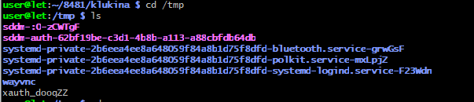
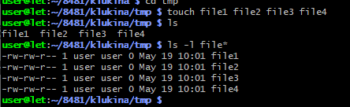
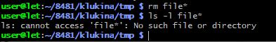
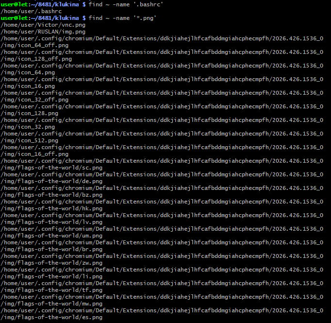
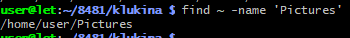
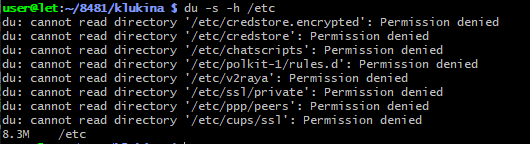
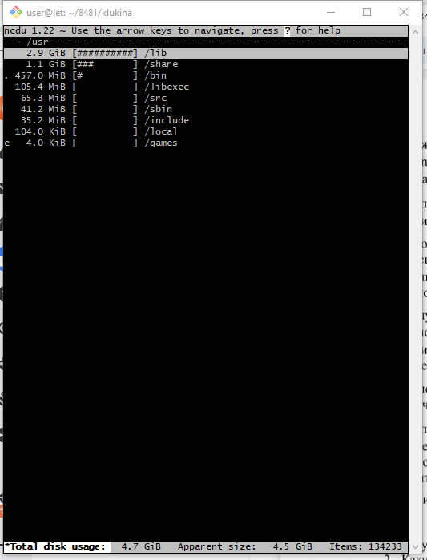
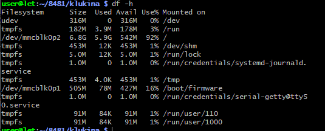

# «Основные команды оболочки операционной системы GNU/Linux — работа с файлами и каталогами»

Цель занятия — ознакомиться с имеющимися в операционной системе GNU/Linux командами оболочки для работы с файлами и каталогами.

### Изучаются следующие основные вопросы:
1) навигация по каталогам файловой системы и просмотр списка файлов и каталогов;
2) создание и удаление файлов и каталогов в файловой системе;
3) копирование и перемещение файлов в файловой системе;
4) копирование и перемещение каталогов в файловой системе;
5) использование шаблонов при работе с файлами и каталогами;
6) поиск файлов и каталогов;
7) создание и использование ссылок на файлы и каталоги;
8) оценка занятого и свободного пространства.

Задание

Практическое занятие проводится на компьютерах с установленной свободно-распространяемой и бесплатной операционной системой Canonical GNU/Linux Ubuntu 12.04 LTS [3] или Debian 7 [4] с окружением рабочего стола GNOME.

Подготовка оборудования к работе

Попросите преподавателя включить компьютер и авторизуйтесь в системе с помощью полученных учетных данных (логина и пароля).

5. Использование шаблонов при работе с файлами и каталогами

Действия настоящего пункта выполняются внутри каталога /tmp.

Перейдите в каталог /tmp с помощью команды cd /tmp. Сохраните результат выполнения команды в отчет.

Создайте несколько файлов со схожими именами, например file1, file2, file3, file4 с помощью команды touch file1 file2 file3 file4. Для быстрых операций над группой файлов со схожими именами удобно использовать шаблоны, как указано ниже.

Для вывода списка файлов, имя которых начинается с file в команде ls -l удобно использовать шаблон file*, т. е. команда примет вид: ls -l file*. Выполните эту команду и сохраните результат ее выполнения в отчет.

Для удаления всех файлов, имя которых начинается с file выполните команду rm file*. Убедитесь в успешном удалении файлов с помощью команды ls -l file* и сохраните результат выполнения команды в отчет.

6. Поиск файлов и каталогов

Поиск файлов и каталогов удобно выполнять с помощью команды find.

Выполните поиск файла .bashrc в домашнем каталоге пользователя с помощью команды find ~ -name '.bashrc'. Сохраните результат выполнения команды в отчет.

Выполните поиск графических файлов с расширением .png в домашнем каталоге пользователя с помощью команды find ~ -name '*.png'. Сохраните результат выполнения команды в отчет.

Выполните поиск каталогов с названием Pictures в домашнем каталоге пользователя с помощью команды find ~ -name 'Pictures'. Сохраните результат выполнения команды в отчет.

8. Оценка занятого и свободного пространства

Для получения информации о занимаемом конкретной папкой пространстве на диске может быть использована команда du (disk usage) с аргументами -h (human-readable – для отображения объемов в понятном для человека виде) и -s (summarize – показывать общий результат для каждого аргумента).

Выполните команду du -s -h /etc для получения информации о занимаемом каталогом /etc месте. Сохраните вывод команды в отчет.

Для получения информации о занимаемом пространстве в наглядном виде можно использовать программу ncdu (ncurses disk usage – программа для отображения занимаемого пространства с использованием библиотеки ncurses аналогично программе Midnight Commander).

Получите информацию о занимаемом каталогом /usr пространстве с помощью команды ncdu /usr. После появления результатов расчета занимаемого пространства сохраните экранный снимок окна терминала в отчет и закройте программу ncdu клавишей <q>.

Для получения информации об использовании дискового пространства предназначена команда df (disk free) с аргументом -h.

Выполните команду df -h для получения информации об общем объеме (Size), использованном (Used), доступном (Avail) и свободном пространстве в процентах (Use%) и указанием точки монтирования (Mounted on). Сохраните вывод команды в отчет.

## Контрольные вопросы

1. Какую команду необходимо использовать для вывода текущего каталога? — pwd
2. Какую команду необходимо использовать для вывода содержимого каталога? — ls
3. Какую команду необходимо использовать для смены текущего каталога? — cd
4. Какую команду необходимо использовать для создания нового каталога? — mkdir
5. Какую команду необходимо использовать для удаления каталога? — rmdir
6. Какие команды необходимо использовать для создания пустого файла? — touch, >
7. Как обозначается оператор перенаправления вывода? — >
8. Какую команду необходимо использовать для копирования объектов? — cp
9. Какую команду необходимо использовать для перемещения объектов? — mv
10. Какую команду необходимо использовать для удаления объектов? — rm
11. Какую команду необходимо использовать для поиска объектов? — find
12. Какую команду необходимо использовать для создания символических ссылок? — ln -s
13. Какую команду необходимо использовать для получения занимаемого каталогом дискового пространства? — du
14. Какую команду необходимо использовать для отображения занимаемого каталогом дискового пространства в наглядном виде? — ncdu
15. Какую команду необходимо использовать для получения информации об использовании дискового пространства? — df