# Лабораторная работа: Работа с файлами и каталогами в операционной системе GNU/Linux в программе Midnight Commander

## Цель занятия

Ознакомиться с программой Midnight Commander, имеющейся в операционной системе GNU/Linux, и предназначенной для работы с файлами и каталогами.

## Изучаемые вопросы

1. Знакомство с программой Midnight Commander
2. Настройка отображения файлов и каталогов
3. Сортировка объектов при отображении
4. Просмотр и редактирование файлов, создание каталогов
5. Копирование файлов и каталогов
6. Перемещение файлов и каталогов
7. Удаление файлов и каталогов
8. Создание символических ссылок
9. Оценка занятого и свободного пространства
10. Подключение к FTP-серверу
11. Подключение к SFTP-серверу по SSH
12. Использование встроенной командной строки

## Задание

Практическое занятие проводится на компьютерах с установленной свободно-распространяемой и бесплатной операционной системой Canonical GNU/Linux Ubuntu 12.04 LTS или Debian 7 с окружением рабочего стола GNOME.

## Подготовка оборудования к работе

Попросите преподавателя включить компьютер и авторизуйтесь в системе с помощью полученных учетных данных (логина и пароля).

---

## 1. Запуск программы Midnight Commander

Откройте окно терминала сочетанием клавиш **Ctrl+Alt+T** или из меню **Applications → Accessories → Terminal**.

Выполните команду:

```bash
mc
```

Разверните окно программы на весь экран.

Ознакомьтесь с внешним видом окна программы и основными управляющими элементами.

> **Отчет оформляйте в редакторе LibreOffice Writer (доступен в меню Applications → Office → LibreOffice Writer).**

Сохраните в отчет вид окна программы Midnight Commander.

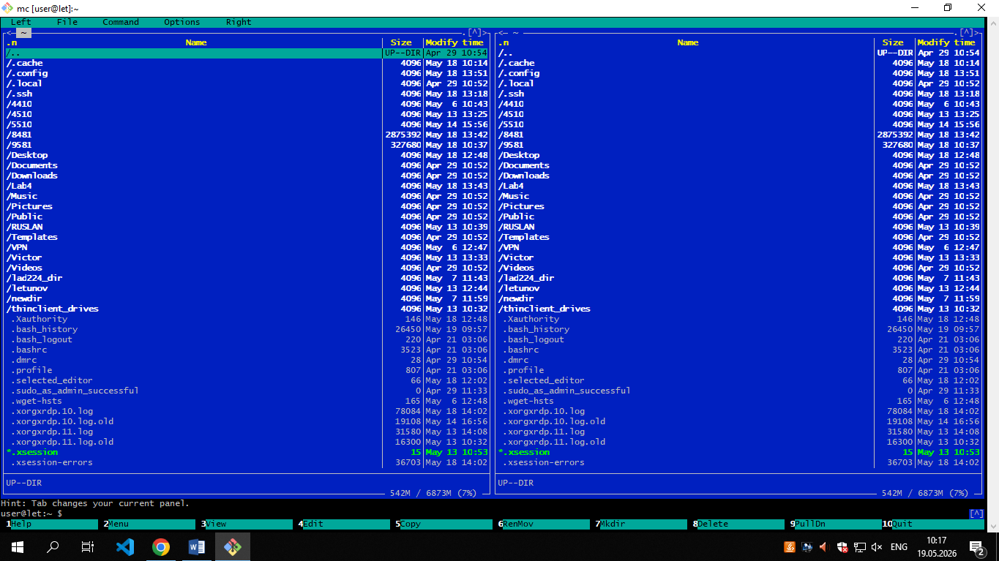

---

## 2. Настройка отображения файлов и каталогов

В окне программы Midnight Commander выполните последовательно следующие действия.

### Просмотр каталога в виде дерева

В выпадающем меню **Right** выберите **Tree** (или сочетание клавиш **F9 → R → T**) и просмотрите структуру каталога `/etc`.

Сохраните экранный снимок окна в отчет.

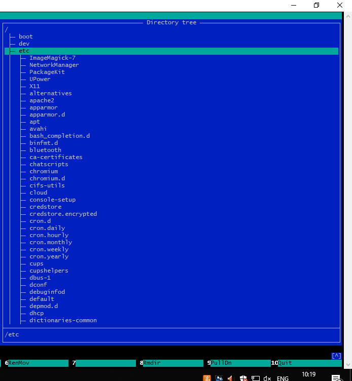

### Получение информации о выбранном объекте

В выпадающем меню **Right** выберите **Info** (или сочетание клавиш **F9 → R → Ctrl+x → i**). На левой панели выберите каталог или файл. В правой части появится информация о выбранном объекте.

Сохраните экранный снимок окна в отчет.

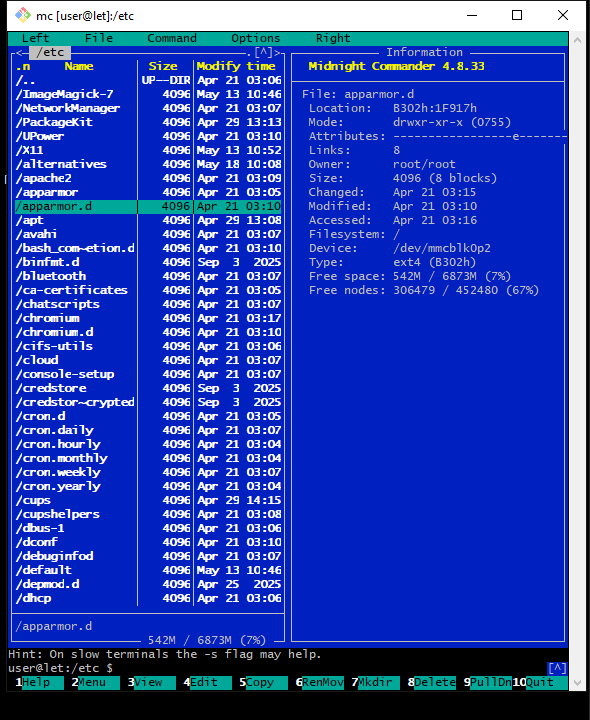

### Быстрый просмотр содержимого файла

В выпадающем меню **Right** выберите **Quick View** (или сочетание клавиш **F9 → R → Ctrl+x → q**). На левой панели выберите последовательно каталог и файл (например, `/etc/fstab`). В правой части появится содержимое выбранного объекта.

Сохраните экранный снимок окна в отчет.

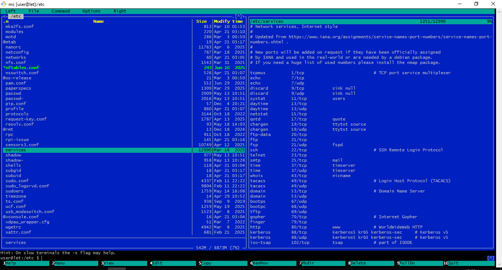


### Переключение режима отображения правой панели на файловый листинг

В выпадающем меню **Right** выберите **File listing** (или сочетание клавиш **F9 → R → g**).

Сохраните экранный снимок окна в отчет.

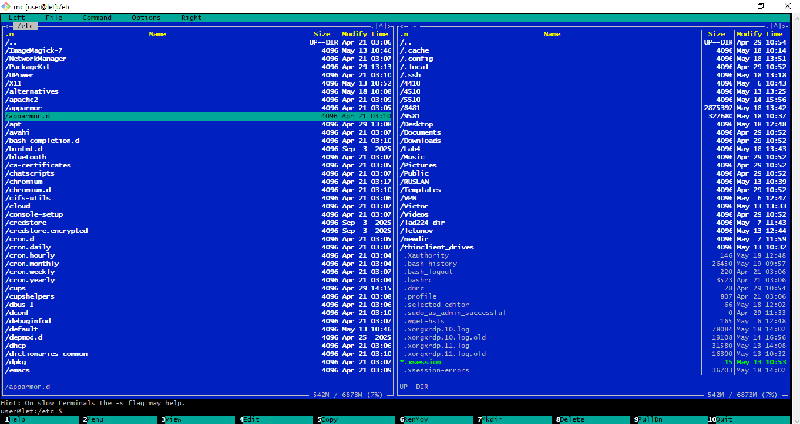

---

## 3. Сортировка объектов при отображении

### Сортировка по размеру

В выпадающем меню **Right** выберите **Sort order** (или сочетание клавиш **F9 → R → S**). В открывшемся окне выберите **Size** левой кнопкой мыши или клавишей **Space** (или клавишей **S**) и нажмите **OK** (или клавишу **Enter**).

Перейдите в каталог `/etc` и опуститесь в самый низ списка выводимых объектов. В нижней части списка должен быть файл максимального размера.

Сохраните экранный снимок окна в отчет.

### Сортировка по дате изменения

В выпадающем меню **Right** выберите **Sort order** (или сочетание клавиш **F9 → R → S**). В открывшемся окне выберите **Modify Time** левой кнопкой мыши или клавишей **Space** (или клавишей **M**) и нажмите **OK** (или клавишу **Enter**).

Перейдите в каталог `/etc` и опуститесь в самый низ списка выводимых объектов. В нижней части списка должен быть файл, время изменения которого наиболее близко к текущему.

Сохраните экранный снимок окна в отчет.

### Сортировка по имени

В выпадающем меню **Right** выберите **Sort order** (или сочетание клавиш **F9 → R → T**). В открывшемся окне выберите **Name** левой кнопкой мыши или клавишей **Space** (или клавишей **N**) и нажмите **OK** (или клавишу **Enter**).

Перейдите в каталог `/etc` и опуститесь в самый низ списка выводимых объектов. В нижней части списка должен быть файл, имя которого начинается на латинскую "z" или близкую к ней букву (в сторону "a").

Сохраните экранный снимок окна в отчет.

---

## 4. Просмотр и редактирование файлов, создание каталогов

### Просмотр файла

Для просмотра файла во встроенном просмотрщике выберите текстовый файл (например, `/etc/fstab`) и выберите из меню **File** пункт **View** (или сочетание клавиш **F9 → F → V**) или нажмите клавишу **F3**.

Сохраните экранный снимок окна в отчет.

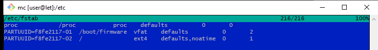

### Создание файла

Для создания файла используйте встроенный редактор. Для этого перейдите в домашний каталог и нажмите **Shift+F4**. Наберите произвольный текст в открывшемся окне редактора, сохраните файл под произвольным именем (например, `newfile`) клавишей **F2** и закройте редактор клавишей **F10**.

Откройте созданный файл в редакторе снова клавишей **F4** (или выберите из меню **File** пункт **Edit**).

Сохраните экранный снимок окна в отчет. Закройте текстовый редактор клавишей **F10**.

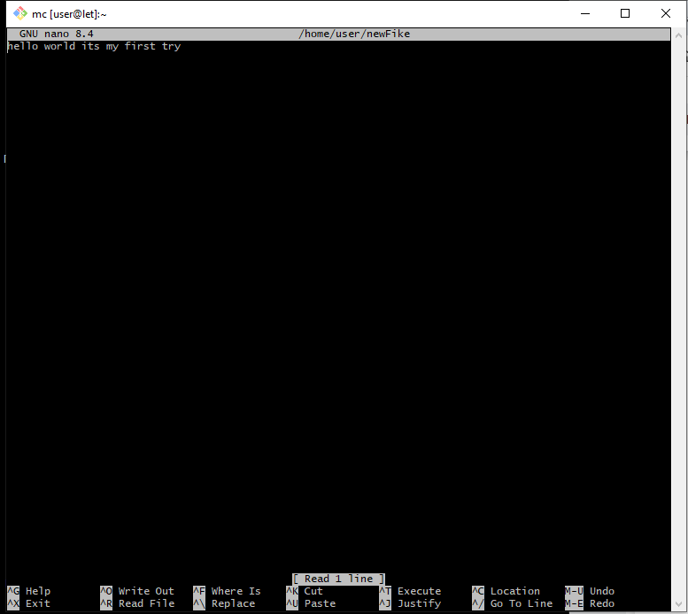

### Создание каталога

Создайте в домашнем каталоге каталог `new_dir`. Для этого нажмите клавишу **F7** (или выберите из меню **File** пункт **Mkdir**). В открывшемся окне укажите имя каталога (например, `new_dir`) и нажмите **OK**.

Установите курсор на созданный каталог и сохраните экранный снимок окна.

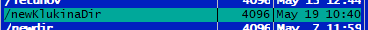

---

## 5. Копирование файлов и каталогов

Программа Midnight Commander очень удобна для выполнения копирования, перемещения и удаления больших объемов файлов и каталогов. Для этого на одной панели (как правило, левой) открывается исходная папка (или содержащая ее папка), а на второй панели (как правило, правой) открывается папка назначения. При этом обе панели обычно находятся в режиме отображения **File listing**. Переключение между панелями выполняется левой клавишей мыши или клавишей **Tab**.

Выполните копирование всего каталога `/etc` в каталог `/tmp`. Для этого на левой панели откройте корневой каталог `/`, а на правой – каталог `/tmp`.

Находясь на левой панели, установите курсор на папку `/etc` и нажмите клавишу **F5** (или выберите из меню **File** пункт **Copy**) для копирования этого каталога на правую сторону.

Откроется окно с параметрами копирования. Обратите внимание на возможность сохранения атрибутов файлов (**Preserve attributes**). Установка этой галочки дает результат копирования, аналогичный команде `cp -p` из прошлой работы.

После нажатия кнопки **OK** начнется копирование с индикацией процесса. По окончании копирования перейдите на правой панели в скопированный каталог и сохраните снимок экрана в отчет.

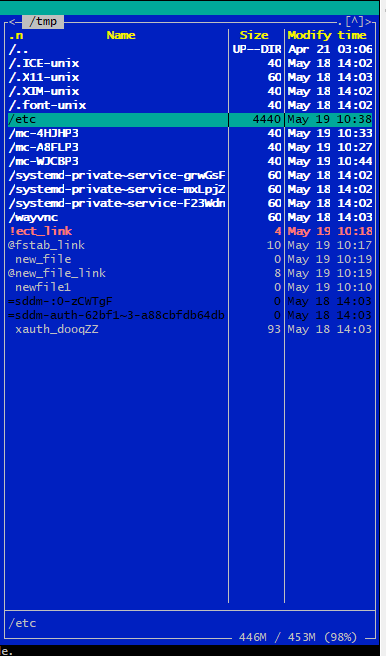

---

## 6. Перемещение файлов и каталогов

Перемещение файлов выполняется аналогично копированию. Откройте на левой и правой панелях каталог `/tmp`. Выполните перемещение только что скопированного каталога `etc` с левой стороны на правую под именем `etc_new`.

Для этого установите на левой панели курсор на папку `etc` и нажмите **F6** (или выберите из меню **File** пункт **Rename/Move**) для перемещения этого каталога на правую сторону.

В открывшемся окне в строке `to:` укажите новое имя для каталога (например, `/tmp/etc_new`). После нажатия кнопки **OK** будет выполнено переименование каталога.

По окончании копирования перейдите на правой панели в переименованный каталог и сохраните снимок экрана в отчет.

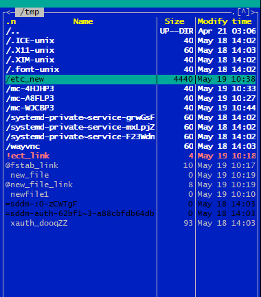

---

## 7. Удаление файлов и каталогов

Удалите созданный каталог `/tmp/etc_new`. Для этого установите курсор на этот каталог и нажмите клавишу **F8** (или выберите из меню **File** пункт **Delete**).

В появившемся окне подтверждения выберите пункт **Yes** для подтверждения удаления. В следующем окне выберите пункт **All** для рекурсивного удаления всего каталога.

По окончании удаления сделайте экранный снимок окна.

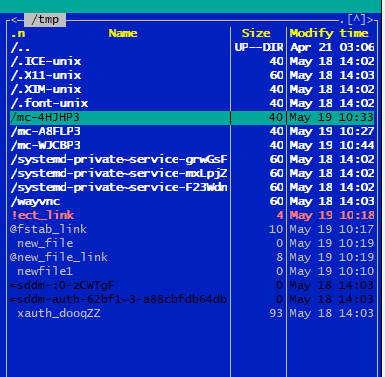

---

## 8. Поиск файлов и каталогов

Поиск файлов и каталогов выполняется выбором из меню **Command** пункта **Find file** (или сочетанием клавиш **F9 → C → F**). Возможен поиск файлов по имени и по содержимому.

### Поиск файлов по имени

Выполните поиск графических файлов с расширением `.png` в домашнем каталоге пользователя. Для этого перейдите на одной из панелей в домашний каталог пользователя и откройте окно поиска.

В поле **File name:** укажите `*.png`, галочку **Search for content** снимите. Нажмите кнопку **OK**.

После появления надписи **Finished** в нижней части окна сохраните экранный снимок окна с результатом. Закройте окно с результатами поиска.

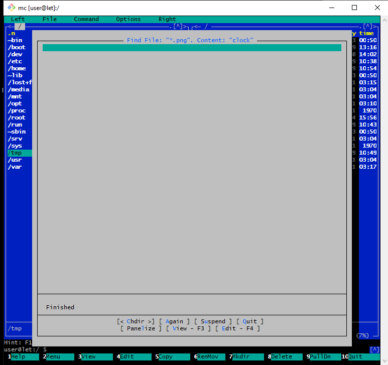

### Поиск текста внутри файлов

Выполните поиск текста `clock` в файлах каталога `/etc`. Для этого откройте каталог `/etc` на одной из панелей и откройте окно поиска.

В поле **File name:** укажите `*`. Поставьте галочку **Search for content**, а в поле **Content:** укажите `clock`. Нажмите кнопку **OK**.

После появления надписи **Finished** в нижней части окна сохраните экранный снимок окна с результатом. Закройте окно с результатами поиска.


---

## 9. Создание символических ссылок

Перейдите в папку `/tmp` на обеих панелях. Выберите любой файл и создайте символическую ссылку на него.

Создание символических ссылок выполняется выбором из меню **File** пункта **Symlink** (или сочетанием клавиш **F9 → F → S**). В открывшемся окне в поле **Symbolic link filename:** допишите в конец предлагаемого имени файла слово `_link` и нажмите **OK**.

Обратите внимание на появление файла с символом `@` перед его именем. Так обозначаются символические ссылки в программе Midnight Commander.

Сохраните экранный снимок окна программы.

Установите курсор на созданную символическую ссылку. При этом путь к файлу, на который она указывает, появится в нижней строке активной панели.

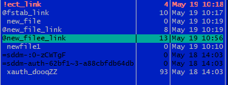

Удалите файл, на который указывает ссылка. Обратите внимание на появление восклицательного знака у символической ссылки. Теперь эта ссылка указывает на несуществующий объект, т.е. является "мертвой".

Сохраните экранный снимок окна.

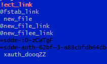

---

## 10. Оценка занятого и свободного пространства

Программа Midnight Commander позволяет получать информацию об использовании дискового пространства и о занимаемом каталогами пространстве.

### Использование дискового пространства

Выводится в правом нижнем углу каждой из панелей в виде: **Доступно / Всего (Доля, %)**.

### Пространство, занимаемое каталогами

Отображается при выборе в меню **Command** пункта **Show directory sizes** (или сочетания клавиш **Ctrl+Space**).

Перейдите в каталог `/etc`, выберите сортировку по размеру и выведите размеры каталогов.

Сохраните экранный снимок окна терминала в отчет.

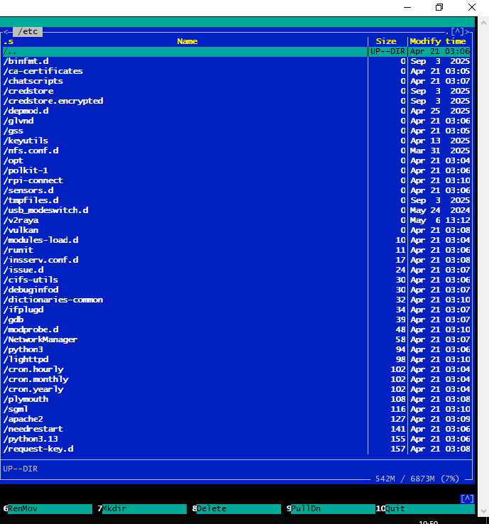

---

## 11. Подключение к FTP-серверу

Программа Midnight Commander имеет встроенный FTP-клиент.

Выполните подключение к FTP-серверу `ftp://mirror.yandex.ru`.

Для этого выберите в меню **Left** пункт **FTP link** (или используйте сочетание клавиш **F9 → L → P**). В открывшемся окне введите адрес `ftp://mirror.yandex.ru` и нажмите кнопку **OK**.

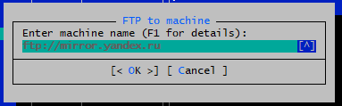

После этого содержимое публичного каталога FTP-сервера появится на активной панели.

Сохраните экранный снимок окна в отчет.

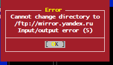

---

## 12. Подключение к SFTP-серверу по SSH

Программа Midnight Commander имеет встроенный SFTP-клиент для подключения по SSH.

Выполните подключение к SFTP-серверу `server`.

Для этого выберите в меню **Left** пункт **Shell link** (или используйте сочетание клавиш **F9 → L → S**). В открывшемся окне введите адрес `server` и нажмите кнопку **OK**.

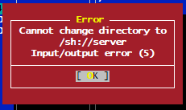

После этого содержимое корневого каталога SFTP-сервера появится на активной панели.

Сохраните экранный снимок окна в отчет.

---

## 13. Использование встроенной командной строки

В нижней части программы Midnight Commander всегда присутствует приглашение командной строки. Оно может использоваться для выполнения команд.

Выполните отдельную команду и просмотрите результат ее работы. Введите команду:

```bash
date
```

Нажмите **Ctrl+O** для временного скрытия окна Midnight Commander. Обратите внимание на вывод текущей даты над приглашением командной строки.

Сохраните экранный снимок окна в отчет.

Нажмите **Ctrl+O** для возвращения в окно Midnight Commander.

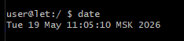

---

## Покажите отчет по семинару преподавателю.

---

## Контрольные вопросы (краткие ответы)

| № | Вопрос | Ответ |
|---|--------|-------|
| 1 | Какие действия необходимо выполнить для запуска программы Midnight Commander? | Открыть терминал (`Ctrl+Alt+T`) и выполнить команду `mc` |
| 2 | Какие действия необходимо выполнить для просмотра содержимого каталога в виде дерева? | Меню Right → Tree (`F9 → R → T`) |
| 3 | Какие действия необходимо выполнить для просмотра информации о выбранном объекте? | Меню Right → Info (`F9 → R → Ctrl+x → i`) |
| 4 | Какие действия необходимо выполнить для быстрого просмотра содержимого файла? | Меню Right → Quick View (`F9 → R → Ctrl+x → q`) |
| 5 | Какие действия необходимо выполнить для переключения активной панели для отображения файлового листинга? | Меню Right → File listing (`F9 → R → g`) |
| 6 | Какие действия необходимо выполнить для сортировки объектов по размеру? | Меню Right → Sort order → Size (`F9 → R → S`, выбрать Size, `Enter`) |
| 7 | Какие действия необходимо выполнить для сортировки объектов по дате изменения? | Меню Right → Sort order → Modify Time (`F9 → R → S`, выбрать Modify Time, `Enter`) |
| 8 | Какие действия необходимо выполнить для сортировки объектов по имени? | Меню Right → Sort order → Name (`F9 → R → T`, выбрать Name, `Enter`) |
| 9 | Какие действия необходимо выполнить для просмотра файла во встроенном просмотрщике? | Выбрать файл, нажать `F3` или меню File → View |
| 10 | Какие действия необходимо выполнить для создания нового файла? | Нажать `Shift+F4`, набрать текст, сохранить `F2`, закрыть `F10` |
| 11 | Какие действия необходимо выполнить для редактирования файла во встроенном редакторе? | Выбрать файл, нажать `F4` |
| 12 | Какие действия необходимо выполнить для создания нового каталога? | Нажать `F7`, ввести имя, `OK` |
| 13 | Какие действия необходимо выполнить для копирования объектов с одной панели на другую? | Выбрать объект, нажать `F5`, `OK` |
| 14 | Какие действия необходимо выполнить для перемещения или переименования объектов с одной панели на другую? | Выбрать объект, нажать `F6`, указать новое имя/путь, `OK` |
| 15 | Какие действия необходимо выполнить для удаления объектов? | Выбрать объект, нажать `F8`, подтвердить |
| 16 | Какие действия необходимо выполнить для поиска объекта по имени? | Меню Command → Find file (`F9 → C → F`), указать имя, `OK` |
| 17 | Какие действия необходимо выполнить для поиска текста внутри файлов? | Меню Command → Find file, указать Content, ввести текст, `OK` |
| 18 | Какие действия необходимо выполнить для создания символической ссылки? | Выбрать объект, меню File → Symlink (`F9 → F → S`), дописать имя, `OK` |
| 19 | Какие действия необходимо выполнить для получения объема каталогов? | Меню Command → Show directory sizes (`Ctrl+Space`) |
| 20 | Какие действия необходимо выполнить для подключения к FTP-серверу? | Меню Left → FTP link (`F9 → L → P`), ввести адрес, `OK` |
| 21 | Какие действия необходимо выполнить для подключения к SFTP-серверу по SSH? | Меню Left → Shell link (`F9 → L → S`), ввести адрес, `OK` |
| 22 | Какие действия необходимо выполнить для просмотра результата выполнения команды во встроенной командной строке? | Ввести команду, нажать `Ctrl+O` для просмотра вывода |
