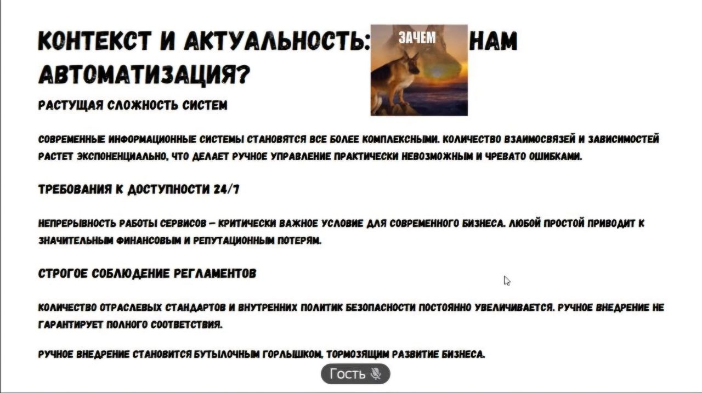
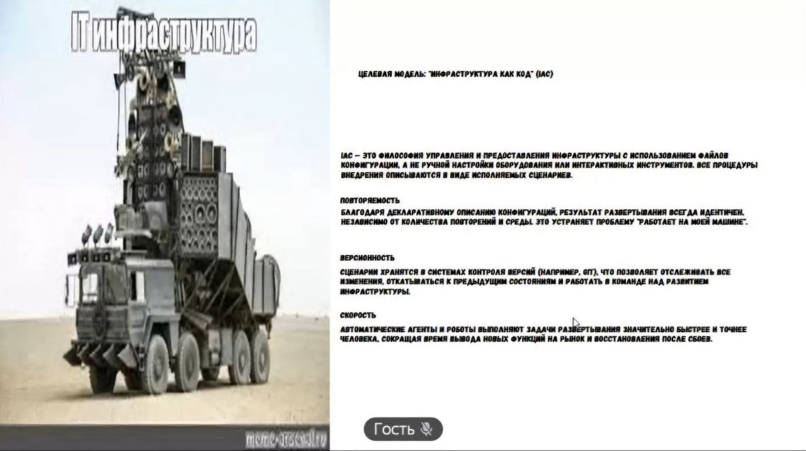
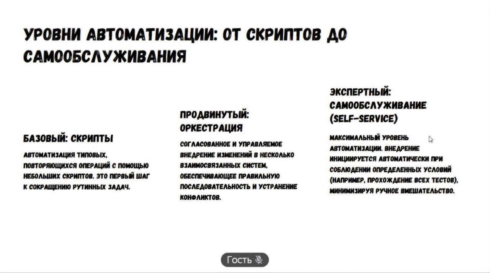
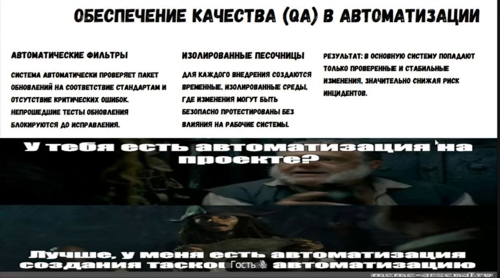
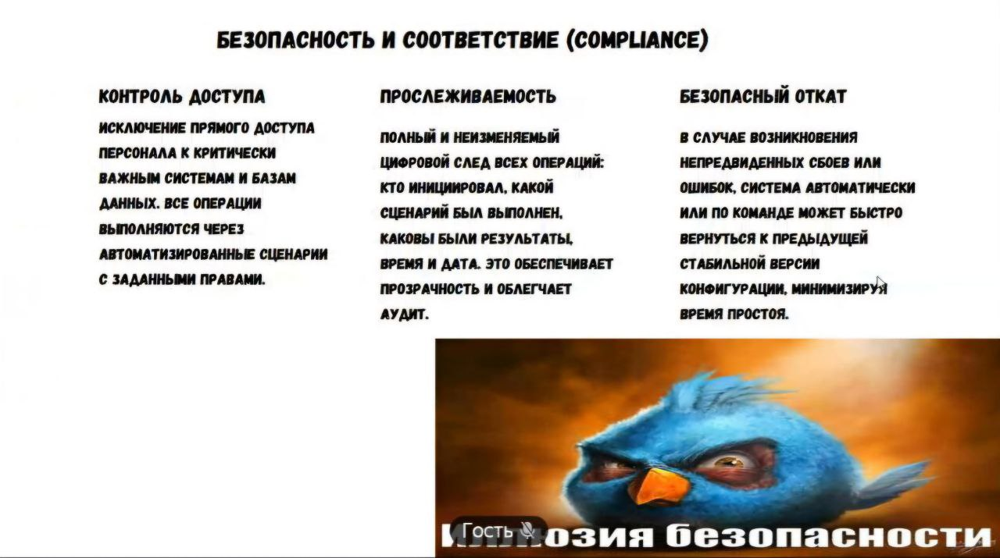
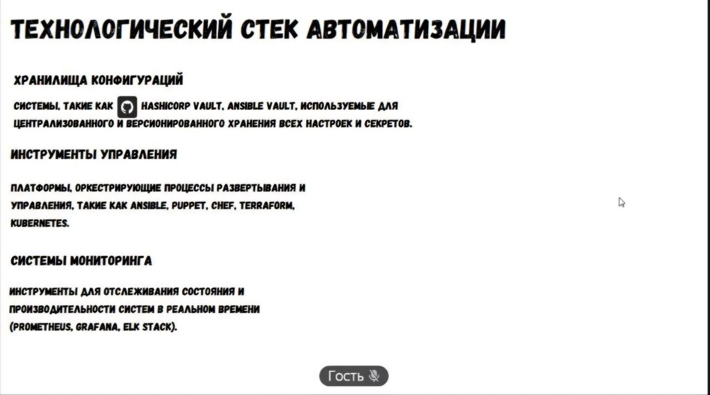

# Infrastructure as Code (IaC, Инфраструктура как код)
— это метод управления ИТ-инфраструктурой (серверами, сетями, базами данных) через файлы конфигурации, а не вручную. IaC позволяет описывать инфраструктуру кодом, что обеспечивает автоматизацию, версионность, скорость развертывания и надежность, снижая риск человеческих ошибок. Часто используется в DevOps для автоматического создания и настройки сред. 
## Основные аспекты IaC:
Автоматизация: 

Устраняет необходимость ручного выделения ресурсов.
## Типы подходов: 

Декларативный (описание желаемого состояния) и императивный (пошаговое описание действий).

Инструменты: Популярные инструменты включают Terraform, Ansible, Chef, Puppet, Salt.
## Преимущества:

Воспроизводимость: Позволяет быстро развертывать идентичные среды.

Масштабируемость: Упрощает управление тысячами серверов.

Контроль версий: Код хранится в системах вроде Git, что позволяет отслеживать изменения.

Безопасность: Стандартизация конфигураций снижает риски уязвимостей. 

## Ключевые понятия:

Дрейф конфигурации: 

Риск несоответствия, который IaC предотвращает, обеспечивая приведение инфраструктуры к описанному в коде состоянию.

Идемпотентность: 

Способность инструментов (например, Ansible) применять конфигурацию многократно без изменения результата, если текущее состояние соответствует требуемому. 

IaC является основой облачных вычислений и неотъемлемой частью современной разработки. 

