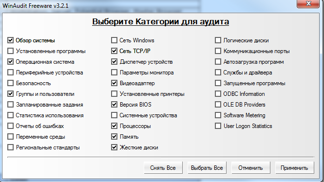

# Лабораторная работа №1
Определение конфигурации персонального компьютера перед проведением тестирования компьютерной системы
### Цель:
Научиться определять аппаратную конфигурацию ПК с помощью различных программных средств.

### Оборудование: 
ПК, средства определения конфигурации ПК WinAudit.

## Порядок выполнения работы.
1.	Запустите программу winaudit из папки практических работ/занятие 2
2.	Ознакомьтесь программой, осмотрите ее возможности.
Вопрос: Какое назначение программы WinAudit?
3.	В программе выберите Вид-> параметр. И установите аудит по следующему изображению

4.	Нажмите применить. Система просканируется согласно выбранным параметрам. Если сканирование не произошло, то нажмите кнопку АУДИТ   и дождитесь сканирование системы.
5.	Использую отчет программы WinAudit заполните таблицу
* Параметр	Название
* Имя процессора	
* Версия BIOS	
* Имя компьютера	
* Объем ОЗУ	
* Объем жесткого диска	
* Операционная система	
* Разрядность ОС	
* Определите сетевой адаптер.	
* Видеоадаптер	
* Возраст пароля пользователя «st»	

2. Попробуйте сохранить отчет программы на рабочий стол.

| Параметр | Название |
|----------|----------|
| Имя процессора | Intel(R) Core(TM) i3-2120 CPU @ 3.30GHz |
|Версия BIOS | HPQOEM - 1072009 |
| Имя компьютера | SP-3-302-00047 |
| Объем ОЗУ | 8192MB |
| Объем жесткого диска  | 232.9GB |
| Операционная система | Microsoft Windows 10 Enterprise 2015 LTSB 64-Bit |
| Разрядность ОС | 64 бит |
| Определите сетевой адаптер | Intel(R) 82579LM Gigabit Network Connection |
| Видеоадаптер | Intel(R) HD Graphics, Intel(R) HD Graphics Family |
| Возраст пароля пользователя | 0 дней |

## Контрольные вопросы (устно).
### Перечислите внутренние устройства системного блока
* Материнская плата — связующее звено для всех деталей.

* Центральный процессор (ЦП) — «мозг» компьютера, выполняющий вычисления.

* Оперативная память (ОЗУ) — временное хранение данных для работы программ.

* Видеокарта — обработка графики и вывод изображения на монитор.

* Накопители (HDD/SSD) — постоянное хранение файлов и системы.

* Блок питания — обеспечение всех узлов электроэнергией.

* Система охлаждения — вентиляторы и радиаторы для отвода тепла.

### Что такое тестирование?
 Тестирование — это процесс проверки соответствия программного обеспечения заявленным требованиям. Его цель — поиск ошибок (багов), проверка корректности работы функций и оценка качества продукта перед его использованием.

### Этапы внедрения программного продукта и компьютерной системы:
Подготовка: установка оборудования и настройка программного окружения. 

Обучение: подготовка персонала и пользователей к работе с новой системой. 

Опытная эксплуатация: работа программы в реальных условиях на ограниченном участке для выявления скрытых проблем. 

Миграция данных: перенос информации из старых систем в новую. 

Приемо-сдаточные испытания: финальная проверка на соответствие ТЗ. 

Переход в промышленную эксплуатацию: полное развертывание и начало штатного использования.