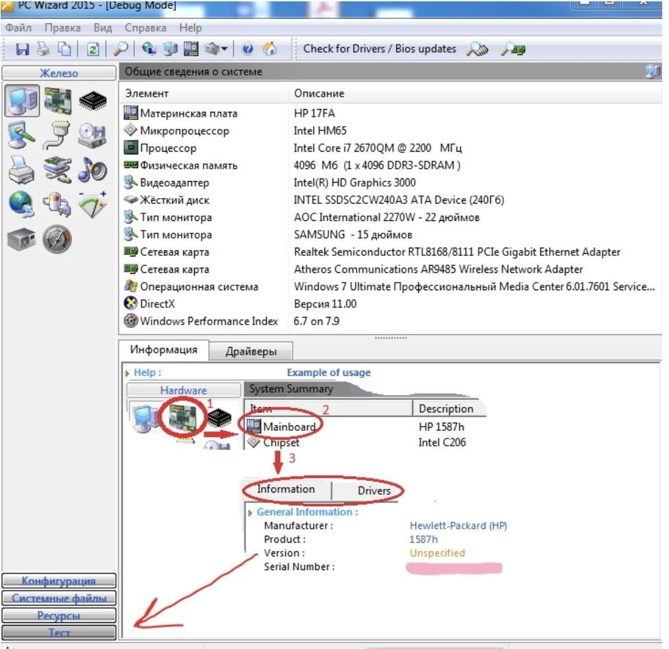
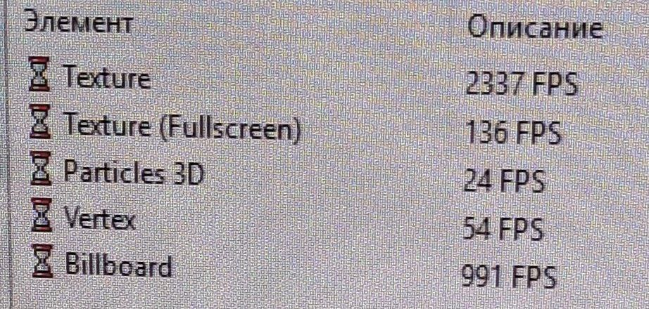
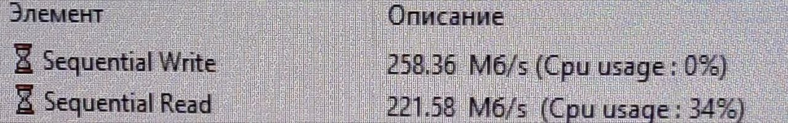
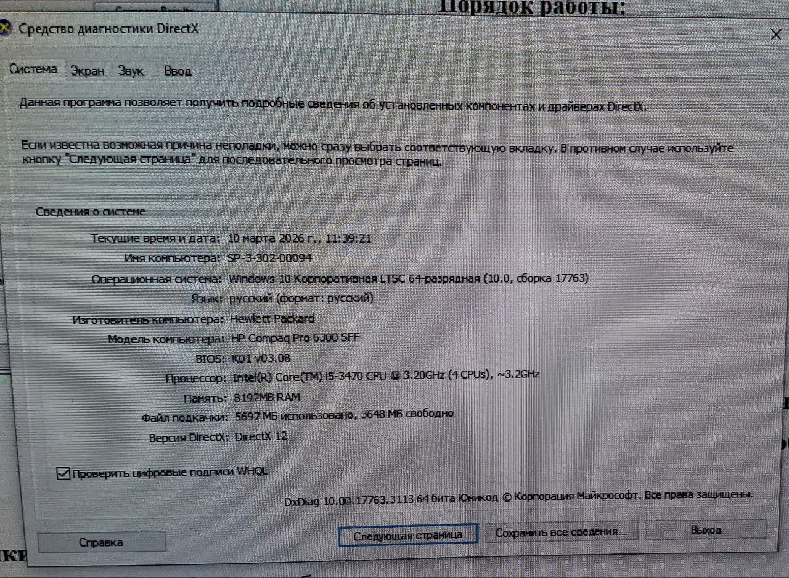
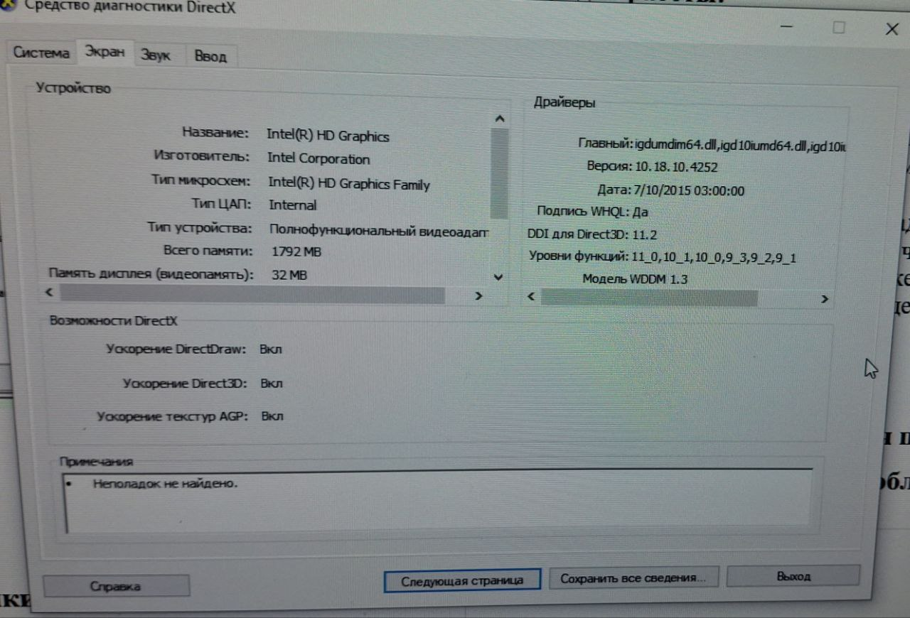
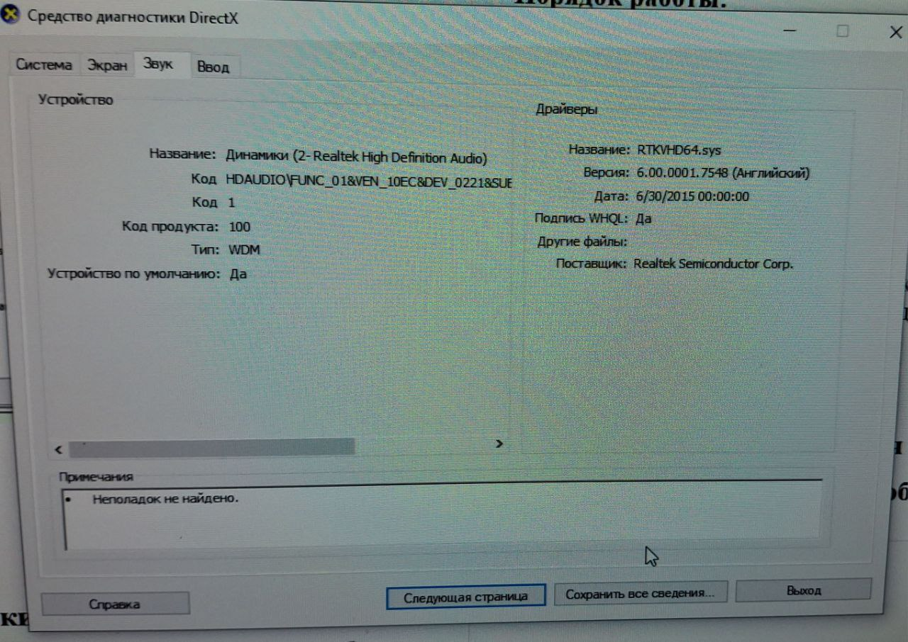
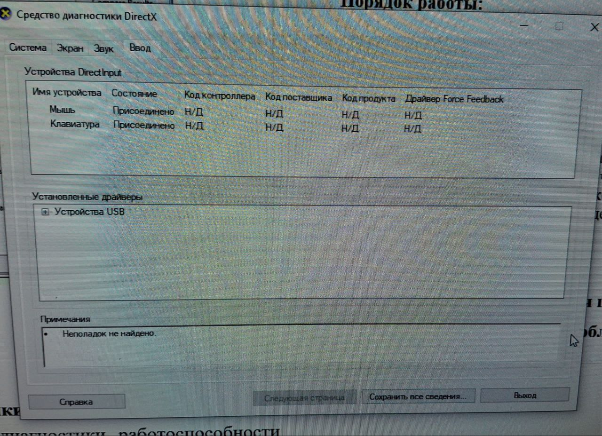

# Лабораторная работа №4
## Диагностика работоспособности персональных компьютеров
## Цель: проводить диагностику компьютера с помощью программ-диагностик.
Программы для диагностики компьютера позволяют проверить конфигурацию компьютера (количество памяти, ее использование, типы дисков и т.д.), а также проверить работоспособность устройств компьютера (прежде всего жестких дисков). Они позволяют выявить «намечающиеся» дефекты дисков (возникающие из-за износа магнитной поверхности диска) и предотвратить потерю данных, хранящихся на диске.

С помощью тестового программного продукта или диагностического комплекса можно определить ряд несложных неисправностей аппаратуры или неправильного конфигурирования системных файлов. Диагностика может выполняться как для системы в целом, так и для отдельных модулей: системной платы, памяти (стандартной, дополнительной и расширенной), видеоподсистемы, жестких дисков, приводов флоппи-дисков, клавиатуры, портов (последовательных и параллельных), координатных устройств, приводов компакт-дисков (CD-ROM) и устройств, имеющих SCSI-интерфейс и т.д.
## Программа PC Wizard 
PC Wizard - программа, которая предоставляет обширную информацию обо всех установленных на компьютере компонентах: память, материнская плата, устройства для хранения и записи информации, видеоподсистема, сетевые устройства, модемы, принтеры и т.д., включая разнообразные данные об операционной системе - версию системы, установленные шрифты, библиотеки, WinSock, активные процессы, имеющиеся модули и сервисы и т.п.

Кроме этого, PC Wizard позволяет протестировать быстродействие процессора, жестких дисков и CD/DVD-привода. Поддерживаются 32- и 64-битные ОС
## Часть 1.
### Порядок работы:
1.	Запустите виртуальную машину Windows 7 (которая осталась у вас от ассемблера)
2.	Перенесите туда файл из папки Занятие «pc-wizard_2014.2.14-setup.exe» (так как программа не совместима с Windows 10)
3. Установить программу PC Wizard.
4.  Запустить данную программу.
5. Слева предложены различные опции  программы, выбираем ТЕСТ

## Задание: 
1. Провести диагностику компьютера по каждому из предложенному виду теста. 
2. Результат каждого теста записать в тетрадь в виде таблицы.

| Название тестирования | Наименование оборудования для теста | Результат в баллах |
|----------|----------|----------|
|Тест процессора|CPU|CPUIDMark Processor: 1356|
|Многопотоковый тест|CPU|CPUIDMark Threading: 3590|
|Тест RAM|ОЗУ|CPUIDMark Memory: 41892|
|Тест глобальной памяти|ОЗУ|Тест выполнен|
|Latency Memory Performance|ОЗУ|Тест выполнен|
|Тест видео/Direct 3D|Видео||
|C:|HDD||
|Video Benchmark|Видео|CPUIDMark Video: 264724|

## Средство диагностики DirectX
Еще одно замечательное средство диагностики работоспособности компьютера называется Средство диагностики DirectX. Данная программа отображает сведения о компонентах и драйверах интерфейса Microsoft DirectX. Программа позволяет проверить работу аудио- и видеокарты, а также установить связь с мультимедийными службами. С помощью средства диагностики также можно отключить некоторые средства аппаратного ускорения. 
# Часть 2.
## Порядок работы:
1. Чтобы запустить Средство диагностики DirectX, нажмите комбинацию клавиш <Win+R> и введите в поле запроса команду dxdiag.
2. При запуске диагностического средства DirectX выполняется автоматическое тестирование всех компонентов интерфейса. С отчетами проверок можно ознакомиться в поле Примечания, расположенном внизу каждой вкладки окна Средство диагностики DirectX. 

Теперь, начиная с первой вкладки Система, последовательно щелкайте на кнопке Следующая страница внизу окна, чтобы перейти от одной вкладки к другой и, тем самым, проверить, все ли в порядке. В поле Примечания каждого окна должна быть желанная фраза “Неполадок не найдено”.

Везде пишет что неполадок не найдено

|

|

|
|
	
## Контрольные вопросы:
1.	Причины возникновения проблем с совместимостью ПО
* Обновления операционной системы: Изменения в API или системных компонентах (например, при переходе на новую версию Windows) делают старые программы неработоспособными ZSComp.

* Устаревшие драйверы и ПО: Использование драйверов, не поддерживающих текущую ОС, или запуск старых версий программ.

* Конфликты между приложениями: Разные программы могут бороться за одни и те же системные ресурсы, библиотеки (.dll) или ключи реестра ZSComp.

* Несоответствие оборудования: Программа требует более мощного процессора, больше оперативной памяти или специфической графики, чем установлено на компьютере Elucidate Education.

* Неверные настройки ОС: Ограниченные права пользователя или некорректная конфигурация системы GitHub.

* Ошибки в реестре: Поврежденные записи в системном реестре препятствуют корректной работе программ.
2.	Методы уменьшения проблем с совместимостью ПО
* Режим совместимости Windows: Нажмите правой кнопкой мыши на файл .exe, выберите «Свойства» -> «Совместимость» и установите режим для более ранней версии ОС.

* Средство устранения неполадок: В Windows 10/11 используйте встроенный инструмент «Устранение неполадок с совместимостью программ».

* Обновление ПО и драйверов: Установка последних версий программ и драйверов устройств часто решает проблемы.

* Виртуализация: Запуск старого ПО на виртуальных машинах (например, Microsoft Virtual PC, VMware, VirtualBox) с более старой ОС.

* Изменение прав доступа: Запуск программы от имени администратора.

* Изменение настроек отображения: Включение режима пониженной цветности (8/16 бит) или отключение масштабирования при высоком разрешении (DPI).

* Использование Compatibility Administrator: Инструмент из Microsoft ACT для более глубокой настройки. 
