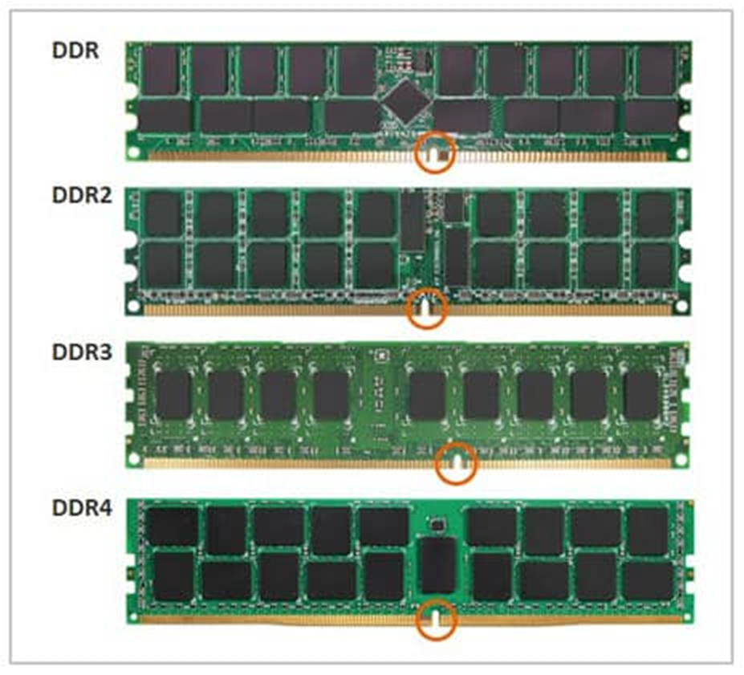

# Понятие совместимости на этапе обследования
При переходе с одной компьютерной системы на другую, перед всеми без исключения организациями встает вопрос совместимости. 

Совместимость — способность различных объектов аппаратных или программных компонентов — взаимодействовать друг с другом.
### Совместимость компьютерного парка  принято делить на 2 части:
Аппаратная совместимость.

Программная совместимость.

В аппаратную совместимость входит соответствие физической составляющей компьютеров требованиям, необходимым для корректной работы операционной системы и приложений.
### Аппаратная совместимость: 
а) комплектующие, удовлетворяющие одному стандарту, являются взаимозаменяемыми; 

б) различные части компьютера не конфликтуют между собой.

## Все программы, работающие на компьютере, можно условно разделить на три категории:
прикладные  программы, непосредственно обеспечивающие выполнение необходимых пользователям работ;

системные  программы - операционная система и программы выполняющие различные вспомогательные функции, например:

управление ресурсами компьютера (драйвера);

создание копий используемой информации;

проверка работоспособности устройств компьютера;

инструментальные программные системы, облегчающие процесс создания новых программ для компьютера.

Если раньше можно было по пальцам перечислить основные категории ПО — операционные системы, трансляторы, пакеты прикладных программ, то сейчас ситуация коренным образом изменилась.

### На сегодняшний день можно сказать, что более или менее определённо сложились следующие группы программного обеспечения:
операционные системы и оболочки;

системы программирования (трансляторы, библиотеки подпрограмм, отладчики и т.д.);

инструментальные системы;

интегрированные пакеты программ;

динамические электронные таблицы;

системы машинной графики;

системы управления базами данных (СУБД);

прикладное программное обеспечение.

## Программная совместимость – возможность выполнение одних и тех же программ на разных компьютерах с получением одинаковых результатов.
В программную часть входят приложения, используемые конечными пользователями. В какой-то степени к программной части стоит отнести и совместимость драйверов устройств. Ведь если для этой операционной системы нет соответствующих драйверов, то и аппаратная часть работать не будет.

Для проверки программной совместимости в начале 90 годов рекомендовалось использование компьютерных игр, например, DOOM.

# Поддержка рабочей среды (совместимость приложений)
Проверка приложений на совместимость с новой операционной системой довольно ответственное занятие на этапе планирования развертывания. 

Не зависимо от того, какие приложения используются в организации, перед началом развертывания необходимо убедиться, что все они совместимы с новой операционной системой. 

Если какие-либо приложения не совместимы, необходимо получить их обновленные версии, эмулировать работу в другой операционной системе или воспользоваться, хотя бы на время, эквивалентами-заменителями. 

Также есть вариант отказаться от использования несовместимых приложений, но это уже крайний вариант.
# Причины возникновения проблем совместимости ПО:
## 1. Запуск и установка приложения.
Во время запуска и установки приложения помешать установки могут 2 проблемы:

Приложение пытается копировать файлы и ярлыки, которые были правомочны для предыдущей ос, но не существуют в новой

Приложение пытается сослаться на компоненты, которые в новой ОС были переименованы
## 2. Контроль пользовательской учетной записи (uac).
Uac увеличивает безопасность Windows, ограничивая доступ к ПК без уровня администратора, что ограничивает запуск приложения большинству пользователей.
## 3. Windows Resource Protection 
предназначен для защиты ресурсов Windows (файлов, папок, реестра) в режиме только для чтения. Установщики приложений, пытавшиеся заменить, удалить, изменить находящиеся под защитой wrp файла могут вызвать сбой с сообщением об ошибке, указывающий на невозможность обновления ресурса.
## 4. 64-bit архитектура. 
Переход на 64-bit архитектуру может вызвать проблемы совместимости
## 5. Изменение версии ОС. 
Это изменение влияет на приложение или установщик, что вызывает сбой.
## 6. Драйвера ядра 
- должны поддерживать новую ОС или быть обновлены.
## 7. Устаревшие компоненты 
- становятся причиной сбоя в работе и установке приложений.
# Методы уменьшения проблем с совместимостью:
1. Изменения конфигурации существующего приложения для обнаружения проблем и создания исправления данного приложения

2. Применение пакетов обновлений или обновлений к приложению.

3. Апгрейд приложений для совместимого релиза (лучшее решение - обновить до более новой версии)

4. Изменений конфигурации безопасности (например: добавить сайт в список надежных сайтов или выключить защищенный режим (не рекомендуется))

5. Запуск приложения в виртуализированной среде (запустить приложение в другой ос используя инструменты виртуализации)

6. Использование функции совместимости приложения: запуск приложения в режиме эмуляции, применение мастера совместимости программ

7. Выбор другого приложения, которое выполняет ту же самую функцию, но не имеет проблем с совместимостью
